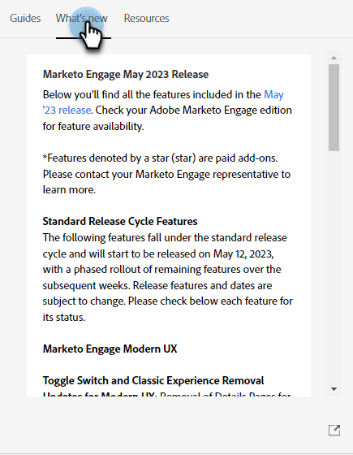

# 支援中心 {#help-center}

Marketo Engage中的幫助中心是獲得幫助的集中場所。 除了與各種資源(如 [產品文檔](/help/marketo/home.md){target="_blank"}, [release information](/help/marketo/release-notes/current.md){target="_blank"}, the [Marketo Community](https://nation.marketo.com/){target="_blank"})，您可以訪問按體驗級別組織的有用產品內部演示。

## 如何訪問 {#how-to-access}

登錄到Marketo Engage後，按一下「幫助」表徵圖。

### 參考線 {#guides}

參考線是熱門功能的快速漫遊。

按一下所需的指南以查看。

按一下 **開始**。

按一下 **下一個** 繼續。

按一下 **完成** 退出漫步。

>[!TIP]
>
>通過按一下 **消除**。

### 新增功能 {#whats-new}

「What is New（新建內容）」頁籤包含Marketo Engage最新版本的完整詳細資訊。

>[!TIP]
>
>按一下底部的箭頭表徵圖以Experience League查看頁面。

### 資源 {#resources}

「資源」(Resources)頁籤可讓您快速而直接地訪問各種方法，以獲得有關Marketo Engage實例的其他幫助。

