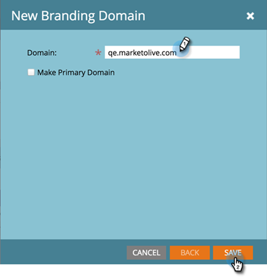

# 設定步驟 {#setup-steps}

**歡迎使用Adobe Marketo Engage！**

在您開始使用之前，請先完成一些步驟。

這些步驟包括：

* 品牌化您的登陸頁面URL和電子郵件連結，以改善信任度和傳遞能力
* 設定Marketo Engage的通訊協定
* 正在同步您的CRM
* 將追蹤程式碼新增至您的公司網站

>[!NOTE]
>
>如果貴公司符合以下條件，您才需要執行這些步驟 **Marketo的新手**. 如果沒有，則可能已完成設定。

部分步驟需要您的IT團隊協助。

## 確保電子郵件傳遞能力 {#ensure-email-deliverability}

>[!NOTE]
>
>您是Launch Pack客戶嗎？ 您可以略過此步驟。 您的顧問會在您啟動電話時，為您提供IT設定指示檔案。

您可以採取幾項措施，確保電子郵件儘可能觸及更多的人。

* **品牌化您的追蹤連結**. 您可以在來自Marketo的電子郵件中所包含的連結中，選擇使用您自己的網域(而非Marketo)的CNAME。 這加強了您的網域品牌，並增加了與收件者的信任度和可傳遞性。
* **將Marketo新增至您的公司電子郵件允許清單**. 通常的最佳實務是在傳送電子郵件給實際人員之前，先將測試電子郵件傳送給您的測試帳戶。 透過將Marketo加入允許清單，您可以防止這些測試電子郵件遭到封鎖或標籤為垃圾訊息。
* **設定SPF和DKIM**. 這些技術可確保您的收件者知道您的Marketo電子郵件不是垃圾郵件。 若要防止收件者的垃圾郵件篩選器拒絕您的Marketo電子郵件，請按照以下步驟執行 [設定電子郵件傳遞能力的SPF和DKIM](/help/marketo/product-docs/email-marketing/deliverability/set-up-spf-and-dkim-for-your-email-deliverability.md).
* **為您的網域設定MX記錄。** MX記錄可讓您接收寄送電子郵件至之網域的郵件，以處理回覆及自動回應。 如果您要從公司網域傳送，您可能已經設定好此專案。 如果沒有，您通常可以設定對應到您公司網域的MX記錄。
* **寄件者地址的建議設定。** 您必須在所有電子郵件行銷活動的「寄件者地址」中，使用有效的、現有的和工作中的電子郵件網域。 設定公司網域的子網域，而非從公司網域傳送可能有所助益。 這將確保企業郵件流中的問題不會影響您的Marketo郵件流，反之亦然。 此外，傳送郵件自 `something@nonexistentdomain.com` 將導致篩選或封鎖電子郵件。 寄件者寄件者地址中使用的任何網域都必須具備有效且運作中的郵局主管@與濫用@帳戶。

如果您使用Google應用程式來託管公司電子郵件，則無法在您的網域下建立濫用@或郵遞員@電子郵件。 若要解決此問題，您需要建立名為「濫用」和「郵遞區長」的群組。 屬於這些群組成員的使用者將會收到傳送至這些地址的電子郵件(例如postmaster@domain.com)。 建立群組的詳細指示可找到 [此處](https://support.google.com/a/answer/33343#adminconsole){target="_blank"}.

選擇電子郵件追蹤連結的CNAME (選擇一個 _不同_ （從您在步驟3中選擇的登陸頁面CNAME）。 部分範例：

* go2。[公司網域].com
* em.[公司網域].com
* 哇！[公司網域].com

第一部分是電子郵件追蹤CNAME， `[EmailTrackingCNAME]`. 您需要將它授予IT。

>[!CAUTION]
>
>電子郵件和登陸頁面CNAME必須不同。 此外，請避免使用「追蹤」或「連結」之類的CNAME。 它經常被標籤為垃圾訊息

若要尋找您的Marketo追蹤連結，請前往 **[!UICONTROL 管理員]** 區域。

按一下 **[!UICONTROL 電子郵件]**.

複製 [!UICONTROL 追蹤連結] 來自您的電子郵件設定。

此 [!UICONTROL 追蹤連結] 格式為： `mkto-[a-z][4 digits].com`.

這是您的 `[MktoTrackingLink]`. 儲存它。 您必須在步驟5中將其提供給IT。

收集「來自」網域。 建立所有「寄件者」網域的清單（如所示） `[Sender]@[FromDomain].com`)，您打算用來從Marketo傳送電子郵件。 多數情況下只有一個。

例如，「marketo.com，」「info.marketo.com，」。 這些是 `[FromDomain1]`，`[FromDomain2]`等 儲存它們。 您必須在步驟5中將其提供給IT。

您現在擁有傳送要求給IT所需的所有資訊！

## 使用CNAME自訂您的登陸頁面URL {#customize-your-landing-page-urls-with-a-cname}

>[!NOTE]
>
>您是Launch Pack客戶嗎？ 您可以略過此步驟。 您的顧問會在您啟動電話時，為您提供IT設定指示檔案。

>[!NOTE]
>
>**需要管理員許可權**

為您的登入頁面選擇一個CNAME。 部分範例：

    * **go**。[CompanyDomain].com
    * **www2**。[CompanyDomain].com
    * **lp**。[CompanyDomain].com

>[!TIP]
>
>保持簡短！ 較短的URL更容易記憶。 我們建議使用「前往」作為網域。

第一部分（粗體）為 `[LandingPageCNAME]`. 您在步驟5中需要它。

若要擷取您將以登陸頁面CNAME取代的Munchkin ID，請前往 **管理員** 區域。

按一下 **我的帳戶**.

複製 [!UICONTROL 帳戶字串] 從登陸頁面設定。

這是 `[Munchkin ID]`. 儲存它。 您必須在步驟5中將其提供給IT。

設定您的網域設定，讓登陸頁面使用您公司的網域，而非Marketo （託管位置）。

## 要求IT人員設定通訊協定 {#ask-it-to-configure-protocols}

>[!NOTE]
>
>您是Launch Pack客戶嗎？ 您可以略過此步驟。 您的顧問會在您啟動電話時，為您提供IT設定指示檔案。

收集完所有必要資訊後，您就可以向IT傳送要求了。 您可以使用下列文字做為範本，將粗體文字取代為您自己的資訊。

[加入本文的連結](/help/marketo/getting-started/initial-setup/configure-protocols-for-marketo.md).

將此文字貼到電子郵件中，並取代粗體預留位置：

>[!NOTE]
>
>請參閱上述步驟3和4，決定取代預留位置的文字。 請記住 `[LandingPageCNAME]` 和 `[EmailTrackingCNAME]` 必須不同。

`----------------------------------------------`

親愛的IT管理員：

我們的行銷團隊現在正使用Marketo平台與我們的人員溝通。 為確保出色的電子郵件傳遞能力，我們需要進行下列變更：

`1)` 對於我們的登入頁面，新增DNS專案(CNAME) **[LandingPageCNAME]**.**[公司網域]**.com，指向 **[Munchkin ID]**.mktoweb.com.

`2)` 針對電子郵件中的追蹤連結，新增DNS專案(CNAME) **[EmailTrackingCNAME]**.**[公司網域]**.com，指向 **[MktoTrackingLink]**.

`3)` 允許列出Marketo。

    *如果在電子郵件允許清單中使用IP位址，請新增下列的IP：
    199.15.212.0/22
    
    192.28.144.0/20
    
    192.28.160.0/19
    
    185.28.196.0/22
    
    130.248.172.0/24
    
    130.248.173.0/24
    
    103.237.104.0/22
    
    94.236.119.0/26

>[!NOTE]
>
>如果您想要取得特定環境的允許清單（IP的縮寫），請聯絡Marketo支援。

    *如果我們的反垃圾郵件系統使用來自網域，請新增以下內容：

**`[FromDomain1]`**
**`[FromDomain2]`**

`4)` 我們需要設定SPF和DKIM，因此Marketo有權代表我們傳送已簽署的電子郵件。

`a.` 若要設定SPF，請在我們的DNS專案中新增下列行：

在TXT中 **[來自網域]**： v=spf1 mx ip4：**[公司IP]**
 包含： mktomail.com ~all

如果我們的DNS專案中已有現有的SPF記錄，只需新增下列內容即可：

包含：mktomail.com

`[`取代 **來自網域** 使用您的電子郵件來自網域(例如： company.com)和 **CorpIP** ，並使用公司電子郵件伺服器的IP位址（例如： 255.255.255.255）。  如果您要透過Marketo從多個網域傳送電子郵件，請讓IT人員為每個網域新增此行（在同一行）。`]`

`b.` 對於DKIM，請針對我們要設定的每個網域建立DNS資源記錄。 我們將簽署的每個網域的主機記錄和TXT值如下：

**`[DKIMDomain1]`**：主機記錄為 **`[HostRecord1]`** 且TXT值為 **[TXTValue1]**.

**`[DKIMDomain2]`**：主機記錄為 **`[HostRecord2]`** 且TXT值為 **`[TXTValue2]`**.

`[`複製 **主機記錄** 和 **TXTValue** 針對每個 **DKIMDomain** 您在遵循以下步驟後完成設定 [此處提供指示](/help/marketo/product-docs/email-marketing/deliverability/set-up-a-custom-dkim-signature.md). 別忘了驗證中的每個網域 **管理員>電子郵件> DKIM** 在IT人員完成此步驟之後。`]`

`5)` 我們需要確保FROM網域有有效的MX記錄 **[FromDomain1]**， **[FromDomain2]**&#x200B;等 您能確認嗎？ 如果沒有，請設定對應至我們的企業網域MX記錄。 這將確保我們能夠處理Marketo郵件的回覆/自動回應者。

完成上述步驟後請通知我，以便我使用Marketo完成設定程式。

感謝您！ 你是最棒的！

祝順心，

**`[Your Name]`**

`----------------------------------------------`

傳送電子郵件給IT。 我們瞭解，IT可能需要一些時間才能完成這些工作。 您可以繼續下一個步驟，但請記住，您必須返回此步驟才能完成Marketo Engage設定。

## 完成Marketo設定後 {#complete-your-marketo-setup-after-it-finishes}

IT完成工作後，請按照下列步驟新增登入頁面和電子郵件CNAME，並啟用DKIM簽署。

前往 **[!UICONTROL 管理員]** 新增登陸頁面CNAME的區域

選取登入頁面並按一下 **[!UICONTROL 編輯]** 在 [!UICONTROL 設定] 區域。

在欄位中輸入您的新網域名稱 **[!UICONTROL 登陸頁面的網域名稱]**. 其形式應為：

`[LandingPageCNAME].[CompanyDomain].com`

在 **[!UICONTROL 遞補]** 頁面欄位，輸入當登陸頁面無法使用時，您希望人員前往的URL。 如果您沒有後援頁面，可以使用公司首頁。 在 **[!UICONTROL 首頁]** 欄位，輸入您的公司網站。

在 [!UICONTROL 管理員] 區域，選取 **[!UICONTROL 電子郵件]** 新增您的電子郵件CNAME

向下捲動至 [!UICONTROL 品牌化網域]. 選取您的網域並按一下 **[!UICONTROL 編輯]**.

在「網域」欄位中，輸入您的電子郵件追蹤網域。 其形式應為：

`[EmailTrackingCNAME].[CompanyDomain].com`. 按一下&#x200B;**[!UICONTROL 保存]**。

## 整合您的CRM {#integrate-your-crm}

這可能是您設定中最令人興奮的部分。 您應該在Marketo中填入所有您儲存在CRM中的潛在客戶和聯絡人！

請根據貴公司使用的CRM從下列專案中選擇。

* [將Marketo Engage與整合 [!DNL Salesforce.com]](/help/marketo/product-docs/crm-sync/salesforce-sync/understanding-the-salesforce-sync.md)
* [將Marketo Engage與整合 [!DNL Microsoft Dynamics]](/help/marketo/product-docs/crm-sync/microsoft-dynamics-sync/understanding-the-microsoft-dynamics-sync.md)

  >[!NOTE]
  >
  >您需要公司的CRM管理員協助才能完成這些步驟。

## 將追蹤程式碼新增至您的網站 {#add-tracking-code-to-your-website}

>[!NOTE]
>
>您是 [!DNL Launch Pack] 客戶？ 您可以略過此步驟。 您的顧問會為您提供 [!DNL Munchkin] IT設定指示檔案中的程式碼指示。

Marketo Engage有自訂追蹤JavaScript (稱為 [!DNL Munchkin])，可用來追蹤任何網頁上的人員活動。 [!DNL Munchkin] 必須將您的網站整合至Marketo。 請依照下列步驟進行 [新增 [!DNL Munchkin] 追蹤程式碼至您的網站](/help/marketo/product-docs/administration/additional-integrations/add-munchkin-tracking-code-to-your-website.md){target="_blank"}.

>[!NOTE]
>
>若要新增追蹤程式碼，需有HTML的體驗。

## 效能期望 {#performance-expectations}

Marketo的效能表現如何？ 其可能會因行銷活動的規模和複雜性而異。 但您可能會預期效能等級與「標準」欄中所列的相同，此欄位位位於以下表格中： [Marketo Engage產品說明](https://helpx.adobe.com/legal/product-descriptions/adobe-marketo-engage---product-description.html){target="_blank"}. The "Performance" and "Performance Plus" columns refer to performance tier packages that provide [higher performance levels](https://nation.marketo.com/t5/product-documents/marketo-engage-performance-tiers/ta-p/328835){target="_blank"}.

>[!MORELIKETHIS]
>
>* [設定Marketo Engage通訊協定](/help/marketo/getting-started/initial-setup/configure-protocols-for-marketo.md)
>
>* [使用者設定](/help/marketo/getting-started/initial-setup/user-setup.md)
