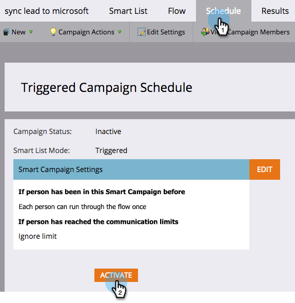

# 針對可能的重複人員自動傳送警報 {#automate-an-alert-for-possible-duplicate-people}

想要在每次建立可能的重複人員時都顯示警示嗎？ 以下說明如何設定Smart Campaign來執行。

1. [建立新的Smart行銷活動](/help/marketo/product-docs/core-marketo-concepts/smart-campaigns/creating-a-smart-campaign/create-a-new-smart-campaign.md){target="_blank"}. 定義下列智慧清單：

* 觸發： **[!UICONTROL 已建立人員]**
* 篩選： **[!UICONTROL 重複欄位]**. 欄位名稱 **[!UICONTROL 是] [!UICONTROL 全名]**

  

  >[!TIP]
  >
  >發揮創造力。 實驗不同的欄位，以獲得更好的篩選結果。

1. 在流程步驟中，選擇 [[!UICONTROL 傳送警報]](/help/marketo/product-docs/core-marketo-concepts/smart-campaigns/flow-actions/send-alert.md){target="_blank"} 流量動作。

   

   >[!TIP]
   >
   >使用 [傳送警報資訊權杖](/help/marketo/product-docs/email-marketing/general/using-tokens/use-the-send-alert-info-token.md){target="_blank"} 以在CRM中加入此人的連結。

   >[!CAUTION]
   >
   >如果您匯入大型清單，可能會一次收到一棧這類警報！
   >
   >此外，兩個同名人員不會自動錶示他們是同一個人。

1. 在中啟動行銷活動 **[!UICONTROL 排程]** 標籤。

   

完成了！ 每次在Marketo中建立具有現有全名的新人員時，都會觸發此智慧型行銷活動。

>[!MORELIKETHIS]
>
>[尋找並合併重複人員](/help/marketo/product-docs/core-marketo-concepts/smart-lists-and-static-lists/managing-people-in-smart-lists/find-and-merge-duplicate-people.md){target="_blank"}
