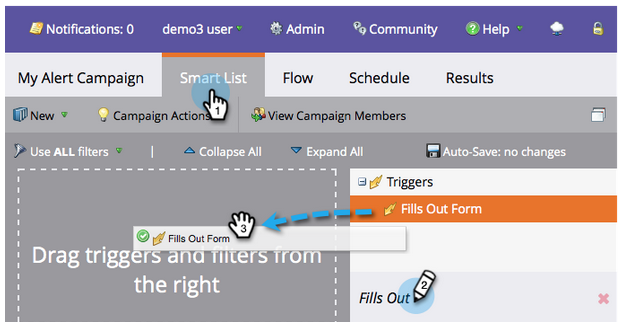

# 提醒銷售代表{#alert-the-sales-rep}

## 任務：當某人填寫您網站上的表格{#mission-alert-the-sales-rep-when-a-person-fills-out-a-form-on-your-web-site}時，提醒銷售代表

若要自動傳送警報電子郵件給業務代表，您只需要寄送警報電子郵件和電子郵件促銷活動。 這是如何做到的。

>[!PREREQUISITES]
>
>[具有表單的著陸頁面](/help/marketo/getting-started/quick-wins/landing-page-with-a-form.md)

## 步驟1:建立警報電子郵件{#step-create-an-alert-email}

1. 前往&#x200B;**行銷活動**&#x200B;區域。

   

1. 選擇在[著陸頁面中以Form](/help/marketo/getting-started/quick-wins/landing-page-with-a-form.md)快速贏取建立的&#x200B;**My Program**，然後在&#x200B;**New**&#x200B;下，按一下&#x200B;**New Local Asset**。

   

1. 按一下&#x200B;**電子郵件**。

   

1. **將電** 子郵件命名為「我的電子郵件警報」，選擇一個模板，然後按一下 **建立**。

   

1. 輸入您希望銷售團隊看到的&#x200B;**From Name**、**From Email**、**Reply-to**&#x200B;和&#x200B;**Subject**。

   

1. 按兩下以編輯電子郵件文字。

   

1. 輸入電子郵件內容。

   

1. 將游標置於要插入該人員聯繫資訊的位置，然後按一下&#x200B;**插入標籤**&#x200B;表徵圖。

   

1. 查找並選擇`{{SP_Send_Alert_Info}}` **Token** ，然後按一下&#x200B;**插入**。

   

   >[!NOTE]
   >
   >{{SP_Send_Alert_Info}}是警報電子郵件的特殊Token。 請參閱[使用傳送警報資訊Token](/help/marketo/product-docs/email-marketing/general/using-tokens/use-the-send-alert-info-token.md)瞭解更多資訊。

1. 按一下&#x200B;**保存**。

   

1. 關閉電子郵件編輯器頁籤／窗口。

   

1. 在&#x200B;**電子郵件動作**&#x200B;下，按一下&#x200B;**批准**。

   

## 步驟2:建立警報觸發器促銷活動{#step-create-an-alert-trigger-campaign}

1. 選擇「我的程式」(**My Program)**&#x200B;先前建立的，然後在&#x200B;**New**&#x200B;下按一下「New Smart Campaign」（新建智慧促銷活動）**。**

   

1. **將促** 銷活動命名為「我的警報促銷活動」，然後按一 **下建立**。

   

1. 在&#x200B;**智慧型清單**&#x200B;標籤下，尋找並拖曳&#x200B;**填寫表單**&#x200B;觸發器至畫布。

   

1. 選取我們先前建立的表單。

   

1. 在&#x200B;**Flow**&#x200B;標籤下，尋找並拖曳&#x200B;**Send Alert**&#x200B;流程動作至畫布。

   

1. 選擇&#x200B;**My Alert Email**&#x200B;之前建立的&#x200B;**將Send To**&#x200B;保留為&#x200B;**Sales Owner**。

   

1. 在&#x200B;**To Other Emails**&#x200B;欄位中輸入您的電子郵件地址。

   

1. 轉至&#x200B;**Schedule**&#x200B;標籤，然後按一下&#x200B;**Activate**&#x200B;按鈕。

   

   >[!TIP]
   >
   >每次&#x200B;**（透過編輯智慧型促銷活動）將**&#x200B;資格規則&#x200B;**設為**（透過編輯智慧型促銷活動），讓同一人多次觸發警報。

1. 在確認螢幕上按一下&#x200B;**激活**。

   

## 步驟3:測試一下！{#step-test-it-out}

1. 選擇您的著陸頁面，然後按一下「檢視已核准的頁面」。****

   

   >[!NOTE]
   >
   >不要忘記核准登陸頁面；他們要等到批准才上線。

1. 填寫表單，然後按一下「提交」。****

   

1. 您應該很快就會收到電子郵件。 在您確認一切都正常運作後，請從「傳送警報」流程中移除您的電子郵件地址（請參閱上述步驟2.7）。

   >[!NOTE]
   >
   >按一下Marketo的&#x200B;**人員資訊**&#x200B;頁籤查看聯繫資訊。

## 任務完成！{#mission-complete}

  

[◄使命7:個人化電子郵件](personalize-an-email.md)

[任務9:更新銷售線索資料►](update-person-data.md)
