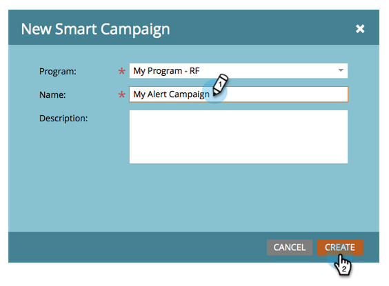
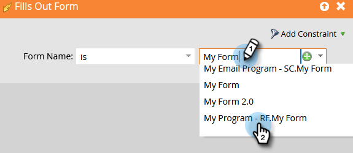

# 通知銷售代表 {#alert-the-sales-rep}

## 任務：當某人填寫您網站上的表單時，通知銷售代表 {#mission-alert-the-sales-rep-when-a-person-fills-out-a-form-on-your-web-site}

要自動向銷售代表發送警報電子郵件，您只需要一封警報電子郵件和一次電子郵件活動。 這是如何做到的。

>[!PREREQUISITES]
>
>[帶表單的登錄頁](/help/marketo/getting-started/quick-wins/landing-page-with-a-form.md){target="_blank"}

## 步驟1:建立警報電子郵件 {#step-create-an-alert-email}

1. 轉到 **[!UICONTROL 營銷活動]** 的子菜單。

   

1. 選擇 **我的程式** 在 [帶表單的登錄頁](/help/marketo/getting-started/quick-wins/landing-page-with-a-form.md){target="_blank"} 快贏，然後下 **[!UICONTROL 新建]** 按一下 **[!UICONTROL 新建本地資產]**。

   

1. 按一下 **[!UICONTROL 電子郵件]**。

   

1. **名稱** 電子郵件「我的電子郵件警報」，選擇模板，然後按一下 **[!UICONTROL 建立]**。

   

1. 輸入 **從名稱**。 **從電子郵件**。 **[!UICONTROL 回復]**, **[!UICONTROL 主題]** 你希望你的銷售團隊能看到。

   

1. 按兩下可編輯電子郵件文本。

   

1. 鍵入電子郵件內容。

   

1. 將游標置於要插入人員聯繫資訊的位置，然後按一下 **插入標籤** 表徵圖

   

1. 查找並選擇 `{{SP_Send_Alert_Info}}` **[!UICONTROL 令牌]** 按一下 **[!UICONTROL 插入]**。

   

   >[!NOTE]
   >
   >{{SP_Send_Alert_Info}} 是警報電子郵件的特殊令牌。 請參閱 [使用發送警報資訊令牌](/help/marketo/product-docs/email-marketing/general/using-tokens/use-the-send-alert-info-token.md){target="_blank"}{target="_blank"} 來瞭解更多資訊。

1. 按一下 **[!UICONTROL 保存]**。

   

1. 按一下 **[!UICONTROL 電子郵件操作]** 下拉並選擇 **[!UICONTROL 批准和關閉]**。

   

## 步驟2:建立警報觸發市場活動 {#step-create-an-alert-trigger-campaign}

1. 選擇 **我的程式** 先前建立，然後在 **[!UICONTROL 新建]** 按一下 **[!UICONTROL 新智慧營銷]**。

   

1. **名稱** 市場活動「我的警報市場活動」，然後按一下 **[!UICONTROL 建立]**。

   

1. 在 **[!UICONTROL 智慧清單]** 頁籤，查找並拖動 **[!UICONTROL 填出窗體]** 觸發到畫布。

   

1. 選擇我們先前建立的窗體。

   

1. 在 **[!UICONTROL 流]** 頁籤，查找並拖動 **[!UICONTROL 發送警報]** 將操作流到畫布。

   

1. 選擇 **[!UICONTROL 我的警報電子郵件]** 建立時間早於 **[!UICONTROL 發送到]** 如 **[!UICONTROL 銷售所有者]**。

   

1. 在 **[!UICONTROL 到其他電子郵件]** 的子菜單。

   

1. 轉到 **[!UICONTROL 計畫]** ，然後按一下 **[!UICONTROL 激活]** 按鈕

   

   >[!TIP]
   >
   >設定 **[!UICONTROL 資格規則]** 至 **[!UICONTROL 每次]** （通過編輯智慧市場活動），允許同一人多次觸發警報。

1. 按一下 **[!UICONTROL 激活]** 確認螢幕上。

   

## 第3步：Test! {#step-test-it-out}

1. 選擇登錄頁並按一下 **[!UICONTROL 「查看已批准」頁]**。

   

   >[!NOTE]
   >
   >不要忘記批准登錄頁；除非獲得批准，否則他們不會活下去。

1. 填寫表單，然後按一下 **[!UICONTROL 提交]**。

   

1. 您應盡快收到電子郵件。 在您驗證所有內容都按應用方式運行後，請從「發送警報」流中刪除您的電子郵件地址（請參閱上面的步驟2.7）。

   >[!NOTE]
   >
   >按一下 **[!UICONTROL 人員資訊]** 的子菜單。

## 任務完成！ {#mission-complete}

  

[◄任務7:個性化電子郵件](/help/marketo/getting-started/quick-wins/personalize-an-email.md)

[任務9:更新人員數►](/help/marketo/getting-started/quick-wins/update-person-data.md)
