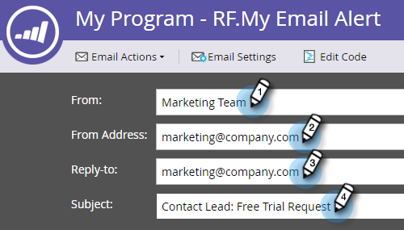
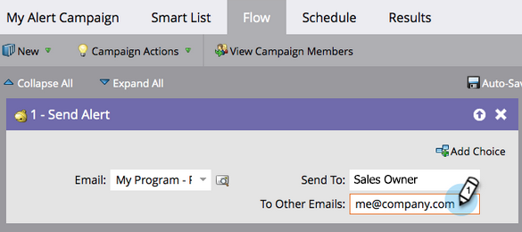

# 警示銷售代表 {#alert-the-sales-rep}

## 任務：當某人填寫您網站上的表單時提醒銷售代表 {#mission-alert-the-sales-rep-when-a-person-fills-out-a-form-on-your-web-site}

若要自動傳送警示電子郵件給銷售代表，您只需要警示電子郵件和電子郵件行銷活動即可。 以下是其操作方式。

>[!PREREQUISITES]
>
>[含有表單的登陸頁面](/help/marketo/getting-started/quick-wins/landing-page-with-a-form.md){target="_blank"}

## 步驟1：建立警報電子郵件 {#step-create-an-alert-email}

1. 前往&#x200B;**[!UICONTROL 行銷活動]**&#x200B;區域。

   

1. 選取您在[登陸頁面（使用表單](/help/marketo/getting-started/quick-wins/landing-page-with-a-form.md){target="_blank"}快速入門）中建立的&#x200B;**我的程式**，然後在&#x200B;**[!UICONTROL 新增]**&#x200B;下按一下&#x200B;**[!UICONTROL 新增本機資產]**。

   

1. 按一下&#x200B;**[!UICONTROL 電子郵件]**。

   

1. **將電子郵件命名為「我的電子郵件警示」**，選取範本並按一下&#x200B;**[!UICONTROL 建立]**。

   

1. 輸入您想要銷售團隊檢視的&#x200B;**寄件者名稱**、**寄件者電子郵件**、**[!UICONTROL 回覆]**&#x200B;及&#x200B;**[!UICONTROL 主旨]**。

   

1. 按兩下以編輯電子郵件文字。

   

1. 輸入電子郵件內容。

   

1. 將游標放在您要插入人員聯絡資訊的位置，然後按一下&#x200B;**插入Token**&#x200B;圖示。

   

1. 尋找並選取`{{SP_Send_Alert_Info}}` **[!UICONTROL 權杖]**，然後按一下&#x200B;**[!UICONTROL 插入]**。

   

   >[!NOTE]
   >
   >{{SP_Send_Alert_Info}}是警示電子郵件的特殊權杖。 請參閱[使用傳送警示資訊Token](/help/marketo/product-docs/email-marketing/general/using-tokens/use-the-send-alert-info-token.md){target="_blank"}{target="_blank"}瞭解更多資訊。

1. 按一下&#x200B;**[!UICONTROL 保存]**。

   

1. 按一下&#x200B;**[!UICONTROL 電子郵件動作]**&#x200B;下拉式清單，然後選取&#x200B;**[!UICONTROL 核准並關閉]**。

   

## 步驟2：建立警報觸發程式行銷活動 {#step-create-an-alert-trigger-campaign}

1. 選取先前建立的&#x200B;**我的程式**，然後在&#x200B;**[!UICONTROL 新增]**&#x200B;下按一下&#x200B;**[!UICONTROL 新增智慧行銷活動]**。

   

1. **將行銷活動命名為**&#x200B;我的警示行銷活動，然後按一下&#x200B;**[!UICONTROL 建立]**。

   

1. 在&#x200B;**[!UICONTROL 智慧列示]**&#x200B;標籤下，尋找&#x200B;**[!UICONTROL 填寫表單]**&#x200B;觸發器並將其拖曳到畫布。

   

1. 選取我們先前建立的表單。

   

1. 在&#x200B;**[!UICONTROL 流量]**&#x200B;標籤下，尋找&#x200B;**[!UICONTROL 傳送警報]**&#x200B;流量動作並拖曳至畫布。

   

1. 選取先前建立的&#x200B;**[!UICONTROL 我的警示電子郵件]**，並保留&#x200B;**[!UICONTROL 傳送給]**&#x200B;作為&#x200B;**[!UICONTROL 銷售擁有者]**。

   

1. 在&#x200B;**[!UICONTROL 至其他電子郵件]**&#x200B;欄位中輸入您的電子郵件地址。

   

1. 移至&#x200B;**[!UICONTROL 排程]**&#x200B;標籤，然後按一下&#x200B;**[!UICONTROL 啟動]**&#x200B;按鈕。

   

   >[!TIP]
   >
   >每次&#x200B;]**（透過編輯Smart Campaign）將**[!UICONTROL &#x200B;資格規則&#x200B;]**設為**[!UICONTROL &#x200B;可允許同一人多次觸發警示。

1. 在確認畫面上按一下&#x200B;**[!UICONTROL 啟動]**。

   

## 步驟3：測試！ {#step-test-it-out}

1. 選取您的登入頁面，然後按一下&#x200B;**[!UICONTROL 檢視核准的頁面]**。

   

   >[!NOTE]
   >
   >別忘了核准登陸頁面；這些頁面要等到核准後才會上線。

1. 填寫表單並按一下&#x200B;**[!UICONTROL 提交]**。

   

1. 您應該很快就會收到電子郵件。 在您確認一切都正常運作後，請從「傳送警報」流程中移除您的電子郵件地址（請參閱上述步驟2.7）。

   >[!NOTE]
   >
   >按一下Marketo中的&#x200B;**[!UICONTROL 個人資訊]**&#x200B;索引標籤以檢視連絡人資訊。

## 任務完成！ {#mission-complete}

  

[◄ Mission 7：個人化電子郵件](/help/marketo/getting-started/quick-wins/personalize-an-email.md)

[任務9：更新人員資料►](/help/marketo/getting-started/quick-wins/update-person-data.md)
