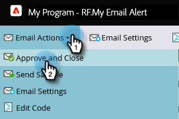

# 警示銷售代表 {#alert-the-sales-rep}

## 任務：當某人填寫您網站上的表單時提醒銷售代表 {#mission-alert-the-sales-rep-when-a-person-fills-out-a-form-on-your-web-site}

若要自動傳送警示電子郵件給銷售代表，您只需要警示電子郵件和電子郵件行銷活動即可。 以下是其操作方式。

>[!PREREQUISITES]
>
>[含有表單的登陸頁面](/help/marketo/getting-started/quick-wins/landing-page-with-a-form.md){target="_blank"}

## 步驟1：建立警報電子郵件 {#step-create-an-alert-email}

1. 前往 **[!UICONTROL 行銷活動]** 區域。

   

1. 選取 **我的程式** 您建立於 [含有表單的登陸頁面](/help/marketo/getting-started/quick-wins/landing-page-with-a-form.md){target="_blank"} 快速獲勝，然後在 **[!UICONTROL 新增]** 按一下 **[!UICONTROL 新增本機資產]**.

   

1. 按一下 **[!UICONTROL 電子郵件]**.

   

1. **名稱** 電子郵件「我的電子郵件警示」，選擇範本並按一下 **[!UICONTROL 建立]**.

   

1. 輸入 **發件人名稱**， **來自電子郵件**， **[!UICONTROL 回覆]**、和 **[!UICONTROL 主旨]** 您希望您的銷售團隊看到的內容。

   

1. 按兩下以編輯電子郵件文字。

   

1. 輸入電子郵件內容。

   

1. 將游標放在您要插入人員連絡資訊的位置，然後按一下 **插入Token** 圖示。

   

1. 尋找並選取 `{{SP_Send_Alert_Info}}` **[!UICONTROL Token]** 並按一下 **[!UICONTROL 插入]**.

   

   >[!NOTE]
   >
   >{{SP_Send_Alert_Info}} 是警報電子郵件的特殊Token。 另請參閱 [使用傳送警報資訊權杖](/help/marketo/product-docs/email-marketing/general/using-tokens/use-the-send-alert-info-token.md){target="_blank"}{target="_blank"} 以深入瞭解。

1. 按一下 **[!UICONTROL 儲存]**.

   

1. 按一下 **[!UICONTROL 電子郵件動作]** 下拉式清單並選取 **[!UICONTROL 核准並關閉]**.

   

## 步驟2：建立警報觸發程式行銷活動 {#step-create-an-alert-trigger-campaign}

1. 選取 **我的程式** 先前建立，然後在 **[!UICONTROL 新增]** 按一下 **[!UICONTROL 新增Smart Campaign]**.

   

1. **名稱** 行銷活動「我的警示行銷活動」並按一下 **[!UICONTROL 建立]**.

   

1. 在 **[!UICONTROL 智慧清單]** 標籤，尋找並拖曳 **[!UICONTROL 填寫表單]** 觸發至畫布。

   

1. 選取我們先前建立的表單。

   

1. 在 **[!UICONTROL 流量]** 標籤，尋找並拖曳 **[!UICONTROL 傳送警報]** 流程動作至畫布。

   

1. 選取 **[!UICONTROL 我的警示電子郵件]** 先前建立並離開 **[!UICONTROL 傳送至]** 作為 **[!UICONTROL 銷售負責人]**.

   

1. 在「 」中輸入您的電子郵件地址 **[!UICONTROL 至其他電子郵件]** 欄位。

   

1. 前往 **[!UICONTROL 排程]** 標籤並按一下 **[!UICONTROL 啟動]** 按鈕。

   

   >[!TIP]
   >
   >設定 **[!UICONTROL 資格規則]** 至 **[!UICONTROL 每次]** （透過編輯Smart Campaign）以允許同一人多次觸發警報。

1. 按一下 **[!UICONTROL 啟動]** 確認畫面上。

   

## 步驟3：測試！ {#step-test-it-out}

1. 選取您的登入頁面，然後按一下 **[!UICONTROL 檢視已核准頁面]**.

   

   >[!NOTE]
   >
   >別忘了核准登陸頁面；這些頁面要等到核准後才會上線。

1. 填寫表單並按一下 **[!UICONTROL 提交]**.

   

1. 您很快就會收到電子郵件。 在您確認一切都正常運作後，請從「傳送警報」流程中移除您的電子郵件地址（請參閱上述步驟2.7）。

   >[!NOTE]
   >
   >按一下 **[!UICONTROL 個人資訊]** 按Tab鍵檢視Marketo中的聯絡人資訊。

## 任務完成！ {#mission-complete}

  

[◄任務7：個人化電子郵件](/help/marketo/getting-started/quick-wins/personalize-an-email.md)

[任務9：更新人員資料►](/help/marketo/getting-started/quick-wins/update-person-data.md)
