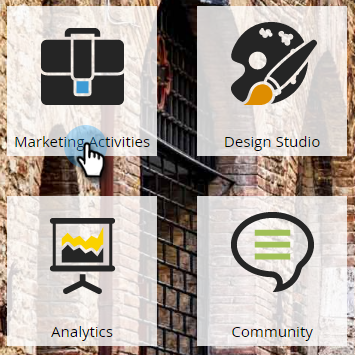
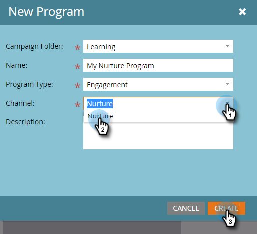
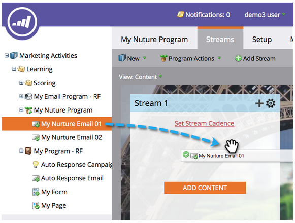

# 滴水，滴水，培養{#drip-drip-nurture}

## 任務：培養最近參加您商展的人才{#mission-nurture-the-people-who-attended-your-recent-tradeshow}

您可以輕鬆在Marketo建立先進而精密的培養系統。 這是方法！

>[!PREREQUISITES]
>
>* [設定並新增人員](/help/marketo/getting-started/quick-wins/get-set-up-and-add-a-person.md)
>* [匯入人員清單](/help/marketo/getting-started/quick-wins/import-a-list-of-people.md)

## 步驟1:建立參與計畫{#step-create-an-engagement-program}

1. 前往&#x200B;**行銷活動**&#x200B;區域。

   

1. 選擇&#x200B;**Learning**&#x200B;資料夾，按一下&#x200B;**New**&#x200B;下拉式清單並選擇&#x200B;**New Program**。

   

1. 輸入&#x200B;**名稱**，並為&#x200B;**程式類型**&#x200B;選擇&#x200B;**參與**。

   

1. 確保&#x200B;**Channel**&#x200B;欄位為&#x200B;**Nurture** ，然後按一下&#x200B;**Create**。

   

   您現在已建立參與計畫。

## 步驟2:建立電子郵件{#step-create-an-email}

1. 選擇您的參與計畫，然後按一下&#x200B;**新建**&#x200B;並選擇&#x200B;**新建本地資產**。

   

1. 按一下&#x200B;**電子郵件**。

   

1. 輸入&#x200B;**名稱**，選擇要使用的&#x200B;**模板**，然後按一下&#x200B;**建立**。

   

   >[!NOTE]
   >
   >沒看到電子郵件編輯嗎？ 您的瀏覽器可能已封鎖視窗。 在您的瀏覽器中啟用[app.marketo.com](https://app.marketo.com)的快顯視窗，然後按一下頂端功能表列中的「編輯草稿」。****

1. 輸入主旨。

   

1. 選擇要編輯的電子郵件區域，按一下齒輪表徵圖並選擇&#x200B;**編輯**。

   

1. 編輯您的電子郵件，然後按一下「儲存」。****

   

1. 關閉電子郵件編輯器頁籤／窗口。

   

1. 在&#x200B;**電子郵件動作**&#x200B;下，按一下&#x200B;**批准**。

   

   >[!NOTE]
   >
   >不要忘記核准您的電子郵件，否則您以後將無法啟動電子郵件。

1. 現在可重複步驟2動作，以建立另一封電子郵件。

   

## 步驟3:新增內容至您的串流{#step-add-content-to-your-stream}

1. 現在，您應該使用您建立的電子郵件，為您的參與計畫建立內容串流。

1. 選擇您的參與計畫，然後按一下&#x200B;**串流**&#x200B;標籤。

   

1. 將您建立的兩封電子郵件拖曳至正確的畫布。

   

   >[!TIP]
   >
   >您也可以使用&#x200B;**新增內容**&#x200B;按鈕或串流&#x200B;**+**&#x200B;圖示。

## 步驟4:啟動串流內容{#step-activate-stream-content}

1. 按一下串流齒輪圖示，一次啟動所有內容，然後按一下「啟動所有內容」。****

   

   >[!NOTE]
   >
   >您必須先核准內容，才能啟動內容。

   幹得好！ 再執行一個步驟，就可開始參與計畫。

## 步驟5:設定串流節奏{#step-set-the-stream-cadence}

1. 按一下「設定串流節奏&#x200B;**」。**

   

1. 編輯與所需計畫匹配的設定，然後按一下&#x200B;**保存**。

   

   您的參與計畫已準備就緒。 現在，讓我們將測試人員加入您的程式。

   >[!NOTE]
   >
   >測試人員是負責檢查您的參與計畫，以在傳送給客戶之前測試其正確性的人員。

## 步驟6:將測試人員新增至您的參與計畫{#step-add-a-test-person-to-your-engagement-program}

1. 轉至&#x200B;**Database**&#x200B;區域。

   

1. 搜尋您的測試人員。

   

   >[!NOTE]
   >
   >請確定測試人員有有效的電子郵件地址，以便您在測試時確認收到電子郵件。

1. 以滑鼠右鍵按一下該人員，然後按一下「方案」並新增至參與方案。

   

1. 選擇&#x200B;**Program**&#x200B;和&#x200B;**Stream**，然後按一下&#x200B;**Run Now**。

   

1. 任務完成！

1. 您應該會在您指定的時間和順序收到電子郵件。

   >[!NOTE]
   >
   >進一步瞭解[參與計畫](/help/marketo/product-docs/email-marketing/drip-nurturing/creating-an-engagement-program/understanding-engagement-programs.md)。

  

[◄使命5:導入銷售線索清單](/help/marketo/getting-started/quick-wins/import-a-list-of-people.md)

[任務7:個人化電子郵件►](/help/marketo/getting-started/quick-wins/personalize-an-email.md)
