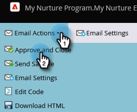

# 滴水，滴水，撫育 {#drip-drip-nurture}

## 任務：培養那些參加你最近的貿易展的人 {#mission-nurture-the-people-who-attended-your-recent-tradeshow}

在Marketo，您可以輕鬆建立先進而精密的培養體系。 這是方法！

>[!PREREQUISITES]
>
>* [設定並新增人員](/help/marketo/getting-started/quick-wins/get-set-up-and-add-a-person.md){target=&quot;_blank&quot;}
>* [匯入人員清單](/help/marketo/getting-started/quick-wins/import-a-list-of-people.md){target=&quot;_blank&quot;}

## 步驟1:建立參與方案 {#step-create-an-engagement-program}

1. 前往 **行銷活動** 的上界。

   

1. 選取 **學習** ，按一下 **新增** 下拉式清單並選取 **新計畫**.

   

1. 輸入 **名稱** 選取 **參與** 針對 **程式類型**.

   

1. 請確定 **管道** 欄位為 **培養** 按一下 **建立**.

   

   您已建立參與計畫。

## 步驟2:建立電子郵件 {#step-create-an-email}

1. 選取您的參與方案，按一下 **新增** 選取 **新本機資產**.

   

1. 按一下 **電子郵件**.

   

1. 輸入 **名稱**，請選取 **範本** 要使用，請按一下 **建立**.

   

   >[!NOTE]
   >
   >沒看到電子郵件編輯器嗎？ 您的瀏覽器可能已封鎖視窗。 從啟用快顯視窗 `app.marketo.com` 在瀏覽器中，按一下 **編輯草稿** 的上界。

1. 輸入主題。

   

1. 選取您要編輯的電子郵件區域，按一下齒輪圖示並選取 **編輯**.

   

1. 編輯您的電子郵件，然後按一下 **儲存**.

   

1. 在 **電子郵件動作**，按一下 **核准並關閉**.

   

   >[!NOTE]
   >
   >請記得核准您的電子郵件，否則您以後將無法啟用。

1. 現在，請重複步驟2-7中的動作，以建立另一封電子郵件。

   

## 步驟3:新增內容至您的資料流 {#step-add-content-to-your-stream}

現在，您可以使用您建立的電子郵件，為您的參與計畫建立內容流。

1. 選取您的參與方案，然後按一下 **資料流** 標籤。

   

1. 按一下 **新增內容** 按鈕。

   

   >[!TIP]
   >
   >您也可以使用 **+** 表徵圖。

1. 保留「電子郵件」類型。 尋找並選取您建立的兩封電子郵件。

   

## 步驟4:啟動串流內容 {#step-activate-stream-content}

1. 按一下串流齒輪圖示，然後按一下「 」，一次啟動所有內容 **啟動所有內容**.

   

   >[!NOTE]
   >
   >您必須先核准內容，才能啟動內容。

   幹得好！ 再進一步，參與計畫就緒。

## 步驟5:設定資料流順序 {#step-set-the-stream-cadence}

1. 按一下 **設定資料流順序**.

   

1. 編輯設定以符合您想要的排程，然後按一下 **儲存**.

   

   你的訂婚計畫已全部設定。 現在，將測試人員新增至您的程式。

   >[!NOTE]
   >
   >測試人員是檢查您的參與方案，以在傳送給客戶之前測試其正確性的人員。

## 步驟6:將測試人員新增至您的參與計畫 {#step-add-a-test-person-to-your-engagement-program}

1. 前往 **資料庫** 的上界。

   

1. 搜尋您的測試人員。

   

   >[!NOTE]
   >
   >請確定測試人員有有效的電子郵件地址，以便您在測試時確認收到電子郵件。

1. 以滑鼠右鍵按一下人員，然後按一下 **方案** 和 **添加到參與計畫**.

   

1. 選取 **方案** 和 **資料流**，然後按一下 **立即運行**.

   

1. 任務完成！

1. 您應該會在您指定的時間和頻度收到電子郵件。

   >[!NOTE]
   >
   >深入了解 [參與計畫](/help/marketo/product-docs/email-marketing/drip-nurturing/creating-an-engagement-program/understanding-engagement-programs.md){target=&quot;_blank&quot;}。

## 任務完成！ {#mission-complete}

  

[◄任務5:匯入人員清單](/help/marketo/getting-started/quick-wins/import-a-list-of-people.md)

[任務7:個人化電子郵件►](/help/marketo/getting-started/quick-wins/personalize-an-email.md)
