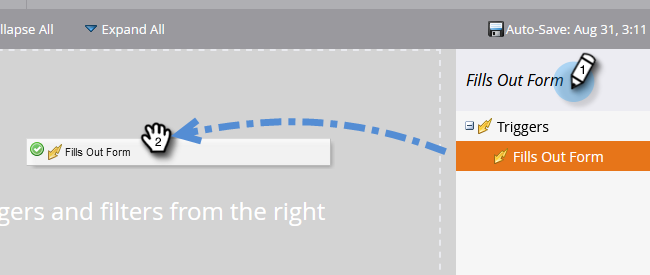

# 電子郵件自動回應 {#email-auto-response}

## 任務：當有人填寫表格時，發送感謝電子郵件 {#mission-send-out-a-thank-you-email-when-a-person-fills-out-a-form}

>[!PREREQUISITES]
>
>* [設定並新增人員](/help/marketo/getting-started/quick-wins/get-set-up-and-add-a-person.md){target=&quot;_blank&quot;}
>* [具有表單的登陸頁面](/help/marketo/getting-started/quick-wins/landing-page-with-a-form.md){target=&quot;_blank&quot;}

## 步驟1:建立電子郵件 {#step-create-an-email}

1. 前往行銷活動區域。

   

1. 在左側功能表中選取您的方案，按一下 **新增** 下拉式清單，然後選取 **新本機資產**.

   

1. 選擇 **電子郵件**.

   

1. 將您的電子郵件命名為「自動回應電子郵件」，選擇範本，然後按一下 **建立**.

   

   電子郵件編輯器將在新視窗或索引標籤中開啟。 如果彈出窗口被阻止，請按一下 **編輯草稿** 在資產摘要頁面上存取電子郵件。

1. 輸入主旨行，然後連按兩下電子郵件的可編輯區域。

   

   _RTF編輯器會在電子郵件編輯器上方開啟。_

1. 反白顯示現有的電子郵件內容。

   

1. 輸入您的電子郵件內容，然後按一下 **儲存**.

   

1. 按一下 **電子郵件動作** 下拉式清單並選取 **核准並關閉**.

   

## 步驟2:建立智慧型行銷活動 {#step-create-a-smart-campaign}

1. 選取您的方案，按一下 **新增** 下拉式清單並選取 **新智慧型行銷活動**.

   

1. **名稱** 您的智慧型促銷活動「自動回應促銷活動」，然後按一下 **建立**.

   

1. 前往 **智慧清單** 標籤。

   

   我們會設定此促銷活動，讓每當有人填寫您在中建立的表單時執行 [**具有表單的登陸頁面**](/help/marketo/getting-started/quick-wins/landing-page-with-a-form.md){target=&quot;_blank&quot;}。

1. 尋找並拖曳 **填寫表單** 觸發至畫布。

   

1. 選擇 **我的表單** 中。 然後按一下 **流量** 標籤。

   

1. 拖曳 **傳送電子郵件** 流動動作。

   

1. 選取 **自動回應電子郵件**. 然後按一下 **排程** 標籤。

   

1. 按一下 **編輯**.

   

1. 選擇 **每次** 按一下 **儲存**.

   

1. 按一下 **啟動**.

   

1. 按一下 **啟動** 在確認畫面上。

   

>[!NOTE]
>
>一旦啟用，每次有人填寫指定的表單時，就會執行此促銷活動。 促銷活動會持續執行，直到停用為止。

## 步驟3:填寫表格 {#step-fill-out-the-form}

1. 選擇 **我的頁面** (這是在 [具有表單的登陸頁面](/help/marketo/getting-started/quick-wins/landing-page-with-a-form.md){target=&quot;_blank&quot;}快速成功)，然後按一下 **預覽**.

   

   _您的「免費試用」登錄頁面將在新索引標籤中開啟。_

1. 填寫您的名字、姓氏和電子郵件地址，然後按一下 **提交**.

   

>[!NOTE]
>
>請確定您使用實際的電子郵件地址，以便收到電子郵件。

## 任務完成 {#mission-complete}

幾分鐘內，您應該會在收件匣中看到自動回應電子郵件。 幹得好！

  

[◄任務3:簡單計分](/help/marketo/getting-started/quick-wins/simple-scoring.md)

[任務5:導入人員清單►](/help/marketo/getting-started/quick-wins/import-a-list-of-people.md)
