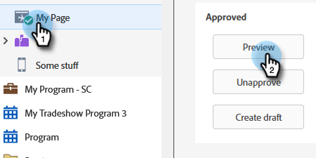

# 電子郵件自動回應 {#email-auto-response}

## 任務：有人填寫表單時，請傳送感謝電子郵件給您 {#mission-send-out-a-thank-you-email-when-a-person-fills-out-a-form}

>[!PREREQUISITES]
>
>* [完成設定並新增人員](/help/marketo/getting-started/quick-wins/get-set-up-and-add-a-person.md){target="_blank"}
>* [含有表單的登陸頁面](/help/marketo/getting-started/quick-wins/landing-page-with-a-form.md){target="_blank"}

## 步驟1：建立電子郵件 {#step-create-an-email}

1. 前往 **[!UICONTROL 行銷活動]** 區域。

   

1. 在左側選單中選取您的程式，按一下 **[!UICONTROL 新增]** 下拉式清單，然後選取 **[!UICONTROL 新增本機資產]**.

   

1. 選取 **[!UICONTROL 電子郵件]**.

   

1. 將您的電子郵件命名為「自動回覆電子郵件」，選擇一個範本，然後按一下 **[!UICONTROL 建立]**.

   

   電子郵件編輯器將在新視窗或索引標籤中開啟。 如果封鎖快顯視窗，請按一下 **[!UICONTROL 編輯草稿]** 在資產摘要頁面上存取電子郵件。

1. 輸入主旨列，然後按兩下電子郵件的可編輯區域。

   

   _RTF編輯器將會在電子郵件編輯器的上方開啟。_

1. 反白顯示現有的電子郵件內容。

   

1. 輸入您的電子郵件內容，然後按一下 **[!UICONTROL 儲存]**.

   

1. 按一下 **[!UICONTROL 電子郵件動作]** 下拉式清單並選取 **[!UICONTROL 核准並關閉]**.

   

## 步驟2：建立Smart Campaign {#step-create-a-smart-campaign}

1. 選取您的程式，按一下 **[!UICONTROL 新增]** 下拉式清單並選取 **[!UICONTROL 新增Smart Campaign]**.

   

1. **名稱** 您的智慧行銷活動「自動回應行銷活動」，然後按一下 **[!UICONTROL 建立]**.

   

1. 前往 **[!UICONTROL 智慧清單]** 標籤。

   

   我們將設定此行銷活動，以便在有人填寫您建立的表單時執行 [**含有表單的登陸頁面**](/help/marketo/getting-started/quick-wins/landing-page-with-a-form.md){target="_blank"}.

1. 尋找並拖曳 **[!UICONTROL 填寫表單]** 觸發至畫布。

   

1. 選取 **[!UICONTROL 我的表單]** 下拉式清單中的。 然後按一下 **[!UICONTROL 流量]** 標籤。

   

1. 拖曳 **[!UICONTROL 傳送電子郵件]** 「流程」動作至左側畫布。

   

1. 選取您的 **自動回覆電子郵件**. 然後按一下 **[!UICONTROL 排程]** 標籤。

   

1. 按一下 **[!UICONTROL 編輯]**.

   

1. 選取 **[!UICONTROL 每次]** 並按一下 **[!UICONTROL 儲存]**.

   

1. 按一下 **[!UICONTROL 啟動]**.

   

1. 按一下 **[!UICONTROL 啟動]** 確認畫面上。

   

>[!NOTE]
>
>一旦啟用，此行銷活動就會在每次有人填寫指定表單時執行。 行銷活動將持續執行直至停用。

## 步驟3：填寫表單 {#step-fill-out-the-form}

1. 選取 **我的頁面** (此專案建立於 [含有表單的登陸頁面](/help/marketo/getting-started/quick-wins/landing-page-with-a-form.md){target="_blank"} 快速獲勝)並點按 **[!UICONTROL 預覽]**.

   

   _您的「免費試用」登陸頁面將在新標籤中開啟。_

1. 使用您的名字、姓氏和電子郵件地址填寫表單，然後按一下 **[!UICONTROL 提交]**.

   

>[!NOTE]
>
>請務必使用您實際的電子郵件地址，以便取得電子郵件。

## 任務完成 {#mission-complete}

在幾分鐘內，您應該就會在收件匣中看到自動回應電子郵件。 做得好！

  

[◄任務3：簡單評分](/help/marketo/getting-started/quick-wins/simple-scoring.md)

[任務5：匯入人員清單►](/help/marketo/getting-started/quick-wins/import-a-list-of-people.md)
