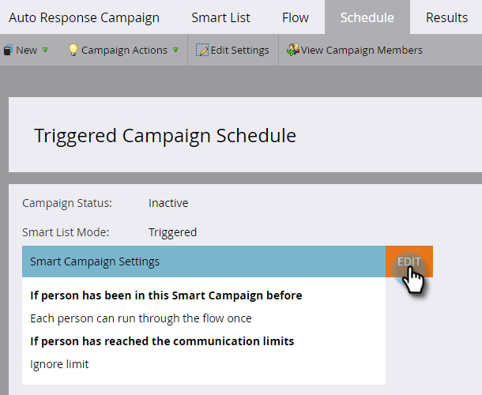

# 電子郵件自動響應 {#email-auto-response}

## 任務：當某人填寫表格時發送一封感謝電子郵件 {#mission-send-out-a-thank-you-email-when-a-person-fills-out-a-form}

>[!PREREQUISITES]
>
>* [設定並添加人員](/help/marketo/getting-started/quick-wins/get-set-up-and-add-a-person.md){target="_blank"}
>* [帶表單的登錄頁](/help/marketo/getting-started/quick-wins/landing-page-with-a-form.md){target="_blank"}

## 步驟1:建立電子郵件 {#step-create-an-email}

1. 轉到 **[!UICONTROL 營銷活動]** 的子菜單。

   

1. 在左菜單中選擇程式，按一下 **[!UICONTROL 新建]** 下拉，然後選擇 **[!UICONTROL 新建本地資產]**。

   

1. 選擇 **[!UICONTROL 電子郵件]**。

   

1. 將電子郵件命名為「自動響應電子郵件」，選擇模板，然後按一下 **[!UICONTROL 建立]**。

   

   將在新窗口或頁籤中開啟電子郵件編輯器。 如果彈出窗口被阻止，請按一下 **[!UICONTROL 編輯草稿]** 訪問電子郵件。

1. 輸入主題行，然後按兩下電子郵件的可編輯區域。

   

   _將在電子郵件編輯器頂部開啟一個富格文本編輯器。_

1. 突出顯示現有電子郵件內容。

   

1. 鍵入您的電子郵件內容，然後按一下 **[!UICONTROL 保存]**。

   

1. 按一下 **[!UICONTROL 電子郵件操作]** 下拉並選擇 **[!UICONTROL 批准和關閉]**。

   

## 步驟2:建立智慧市場活動 {#step-create-a-smart-campaign}

1. 選擇程式，按一下 **[!UICONTROL 新建]** 下拉並選擇 **[!UICONTROL 新智慧營銷]**。

   

1. **名稱** 您的智慧市場活動「自動響應市場活動」，然後按一下 **[!UICONTROL 建立]**。

   

1. 轉到 **[!UICONTROL 智慧清單]** 頁籤。

   

   我們將設定此市場活動以在人員填寫您在中建立的表單時運行 [**帶表單的登錄頁**](/help/marketo/getting-started/quick-wins/landing-page-with-a-form.md){target="_blank"}。

1. 查找並拖動 **[!UICONTROL 填出窗體]** 觸發到畫布。

   

1. 選擇 **[!UICONTROL 我的表格]** 的下界。 然後按一下 **[!UICONTROL 流]** 頁籤。

   

1. 拖動 **[!UICONTROL 發送電子郵件]** 向左畫布顯示流操作。

   

1. 選擇 **自動響應電子郵件**。 然後按一下 **[!UICONTROL 計畫]** 頁籤。

   

1. 按一下 **[!UICONTROL 編輯]**。

   

1. 選擇 **[!UICONTROL 每次]** 按一下 **[!UICONTROL 保存]**。

   

1. 按一下 **[!UICONTROL 激活]**。

   

1. 按一下 **[!UICONTROL 激活]** 確認螢幕上。

   

>[!NOTE]
>
>一旦激活，此市場活動將在每次人員填寫指定表單時運行。 這個活動會一直進行到停用為止。

## 第3步：填寫表單 {#step-fill-out-the-form}

1. 選擇 **我的頁面** (建立於 [帶表單的登錄頁](/help/marketo/getting-started/quick-wins/landing-page-with-a-form.md){target="_blank"} 按一下 **[!UICONTROL 預覽]**。

   

   _您的「免費試用」登錄頁將在新頁籤中開啟。_

1. 用您的名字、姓氏和電子郵件地址填寫表單，然後按一下 **[!UICONTROL 提交]**。

   

>[!NOTE]
>
>確保使用您的實際電子郵件地址，以便您能夠收到電子郵件。

## 任務完成 {#mission-complete}

您應在幾分鐘內在收件箱中看到自動響應電子郵件。 幹得好！

  

[◄任務3:簡單計分](/help/marketo/getting-started/quick-wins/simple-scoring.md)

[任務5:導入人員列►](/help/marketo/getting-started/quick-wins/import-a-list-of-people.md)
