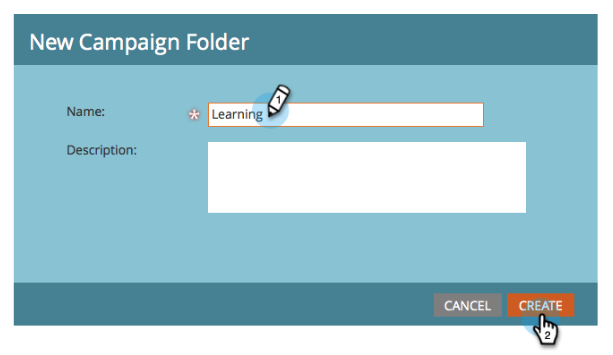
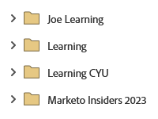
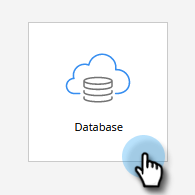

# 設定並添加人員 {#get-set-up-and-add-a-person}

在開始執行任務之前，有幾件事要做。

## 步驟1:登錄到Marketo {#step-log-in-to-marketo}

1. [登錄Marketo](https://app.marketo.com){target="_blank"} 使用您通過電子郵件收到的憑據。

   

## 步驟2:建立學習資料夾 {#step-create-a-learning-folder}

讓我們建立一個資料夾來保存您在任務中會做的所有內容。

1. 轉到 **[!UICONTROL 營銷活動]** 的子菜單。

   

1. 按一下 **[!UICONTROL 新建]** 下拉並選擇 **[!UICONTROL 新建市場活動資料夾]**。

   

1. 將資料夾命名為「學習」，然後按一下 **[!UICONTROL 建立]**。

   

1. 您將在左側菜單中看到新的「學習」資料夾。

   

## 第3步：將自己添加為人 {#step-add-yourself-as-a-person}

在Marketo加入您，以便您以後可以向自己發送test電子郵件。

1. 轉到 **[!UICONTROL 資料庫]** 的子菜單。

   

1. 按一下 **[!UICONTROL 新建]** 下拉並選擇 **[!UICONTROL 新人]**。

   

1. 鍵入您的姓名、電子郵件地址和公司名稱，然後按一下 **[!UICONTROL 建立]** 以個人的身份加入。

   

   >[!CAUTION]
   >
   >Marketo **不** 支援包含emoji的電子郵件地址。

1. 要查看您的人員，請開啟 [!UICONTROL 系統智慧清單] 按一下 **[!UICONTROL 所有人]**。

   

1. 按一下 **[!UICONTROL 人物]** 頁籤。 你應該在資料庫中看到自己。

   

## 設定完成 {#set-up-complete}

你準備好開始第一次任務了！

  

[任務1:發送電子郵件爆►](/help/marketo/getting-started/quick-wins/send-an-email.md)
