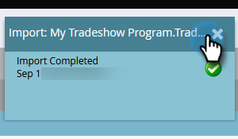

# 匯入人員清單 {#import-a-list-of-people}

## 任務：將貿易展會與會者的電子錶格清單導入您的資料庫 {#mission-import-a-spreadsheet-list-of-trade-show-attendees-into-your-database}

>[!PREREQUISITES]
>
>[設定並新增人員](/help/marketo/getting-started/quick-wins/get-set-up-and-add-a-person.md){target=&quot;_blank&quot;}

在本教學課程中，您將學習如何將試算表檔案中的人員匯入Marketo。

## 步驟1:下載及編輯試算表 {#step-download-and-edit-a-spreadsheet}

1. 若要開始，請下載實務試算表檔案([**tradeshow-theadters.csv**](/help/marketo/getting-started/assets/tradeshow-attendees.csv){target=&quot;_blank&quot;})傳送至您的電腦。

   

   >[!NOTE]
   >
   >匯入日期時，請使用此格式： **9/21/20** （月/日/年）。

   >[!NOTE]
   >
   >匯入的任何日期/時間欄位都會視為中央時間。 如果您的日期/時間欄位位位於不同時區，則可使用Excel公式將其轉換為中央時間（美國/芝加哥）。

1. 新增您自己的名字、姓氏、實際電子郵件地址（以便您接收下次任務時將發送的培訓電子郵件）和職銜。 將檔案儲存在電腦上。

   

   >[!CAUTION]
   >
   >Marketo **not** 支援包含emoji的電子郵件地址。

## 步驟2:建立方案 {#step-create-a-program}

1. 前往 **行銷活動** 的上界。

   

1. 選取 **學習** 資料夾，然後在 **新增** 按一下 **新計畫**.

   

1. **名稱** 「我的貿易展會計畫」，並為 **程式類型**.

   

1. 選擇 **貿易展** 針對 **管道** 按一下 **建立**.

   

>[!NOTE]
>
>事件程式在特定日期發生。 深入了解 [**事件**](/help/marketo/product-docs/demand-generation/events/understanding-events/understanding-event-programs.md){target=&quot;_blank&quot;}。

## 步驟3:將試算表匯入Marketo {#step-import-your-spreadsheet-into-marketo}

1. 在 **我的貿易展計畫**，按一下 **新增** 選取 **新本機資產**.

   

1. 選擇 **清單**.

   

1. **名稱** 列出「Tradeshow Atteders」，然後按一下 **建立**.

   

1. 在 **Tradeshow與會者** 清單，按一下 **清單動作** 選取 **匯入清單**.

   

   >[!CAUTION]
   >
   >如果您使用自己的CSV檔案，請確定其編碼為UTF-8、UTF-16、Shift-JIS或EUC-JP。

   >[!NOTE]
   >
   >CSV檔案的大小限制為100MB。

1. **瀏覽** 到 **tradeshow-theadters.csv** 在電腦上按一下試算表檔案 **下一個**.

   

   >[!NOTE]
   >
   >在清單導入模式中，選擇 **略過新人員和更新** 表示您不會影響現有人員記錄或記錄任何活動。 如果您想要快速且預先篩選的現有人員靜態清單以用於行銷活動，請使用此模式。 選擇此模式將：
   >
   > * 略過建立新人員
   > * 跳過人員欄位更新
   > * 略過活動記錄

1. 將清單欄位對應至其各自的Marketo欄位，然後按一下 **下一個**.

   

   >[!TIP]
   >
   >欄標題應一律與欄位完全相符（區分大小寫），以取得最佳的自動對應結果。 如果您使用自訂欄位，但在下拉式清單中看不到，請返回 [建立](/help/marketo/product-docs/administration/field-management/create-a-custom-field-in-marketo.md){target=&quot;_blank&quot;}，以便成為選項。

   >[!NOTE]
   >
   >如果有任何欄位不想匯入，請選取 **忽略** 在「Marketo欄位」下拉式功能表中。

1. 選擇 **我的貿易展計畫** 針對 **贏取計畫**，然後按一下 **匯入**.

   

1. 等待您的人員導入，然後關閉導入進度彈出窗口。

   

1. 返回 **我的貿易展計畫**，按一下 **成員** 標籤。 你會看見剛進來的人。

   

>[!NOTE]
>
>您可以追蹤方案會籍，以分析方案的成功。 深入了解 [**方案**](/help/marketo/product-docs/core-marketo-concepts/programs/creating-programs/understanding-programs.md){target=&quot;_blank&quot;}。

## 任務完成 {#mission-complete}

您的商展與會者現在是您Marketo計畫的成員！

  

[◄任務4:電子郵件自動回應](/help/marketo/getting-started/quick-wins/email-auto-response.md)

[任務6:滴，滴，撫►](/help/marketo/getting-started/quick-wins/drip-drip-nurture.md)
