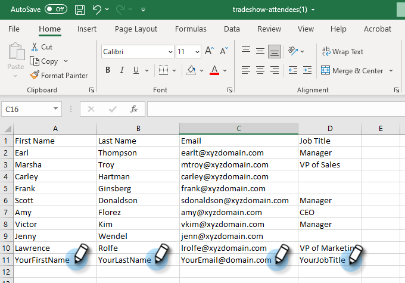

# 匯入人員清單 {#import-a-list-of-people}

## 任務：將貿易展覽會出席者的試算表清單匯入您的資料庫 {#mission-import-a-spreadsheet-list-of-trade-show-attendees-into-your-database}

>[!PREREQUISITES]
>
>[完成設定並新增人員](/help/marketo/getting-started/quick-wins/get-set-up-and-add-a-person.md){target="_blank"}

在本教學課程中，您將瞭解如何將人員從試算表檔案匯入Marketo。

## 步驟1：下載並編輯試算表 {#step-download-and-edit-a-spreadsheet}

1. 若要開始，請下載我們的實務試算表檔案([**tradeshow-attendees.csv**](/help/marketo/getting-started/assets/tradeshow-attendees.csv){target="_blank"})到您的電腦。

   

   >[!NOTE]
   >
   >匯入日期時，請使用此格式： **9/21/20** （月/日/年）。

   >[!NOTE]
   >
   >匯入的任何日期/時間欄位都會視為中部時間。 如果您的日期/時間欄位位於不同的時區，您可以使用Excel公式將其轉換為中部時間（美洲/芝加哥）。

1. 新增您自己的名字、姓氏、實際電子郵件地址（以便接收您下次執行任務時將傳送的培養電子郵件）以及職稱。 將檔案儲存在電腦上。

   

   >[!CAUTION]
   >
   >Marketo會 **not** 支援包含表情符號的電子郵件地址。

## 步驟2：建立方案 {#step-create-a-program}

1. 前往 **[!UICONTROL 行銷活動]** 區域。

   

1. 選取您的 **學習** 資料夾，然後在 **[!UICONTROL 新增]** 按一下 **[!UICONTROL 新計畫]**.

   

1. **名稱** 計畫「我的貿易展覽計畫」並選取「事件」作為 **[!UICONTROL 計畫型別]**.

   

1. 選取 **[!UICONTROL 貿易展]** 的 **[!UICONTROL 頻道]** 並按一下 **[!UICONTROL 建立]**.

   

>[!NOTE]
>
>事件程式會在特定日期發生。 進一步瞭解 [**事件**](/help/marketo/product-docs/demand-generation/events/understanding-events/understanding-event-programs.md){target="_blank"}.

## 步驟3：將試算表匯入Marketo {#step-import-your-spreadsheet-into-marketo}

1. 在 **我的貿易展計畫**，按一下 **[!UICONTROL 新增]** 並選取 **[!UICONTROL 新增本機資產]**.

   

1. 選取 **[!UICONTROL 清單]**.

   

1. **名稱** 「商展與會者」清單並按一下 **[!UICONTROL 建立]**.

   

1. 在您的 **[!UICONTROL 貿易展覽出席者]** 清單，按一下 **[!UICONTROL 清單動作]** 並選取 **[!UICONTROL 匯入清單]**.

   

   >[!CAUTION]
   >
   >如果您使用自己的CSV檔案，請確定它是以UTF-8、UTF-16、Shift-JIS或EUC-JP編碼。

   >[!NOTE]
   >
   >CSV檔案的大小限製為100MB。

1. **[!UICONTROL 瀏覽]** 至 **tradeshow-attendees.csv** 試算表檔案，然後按一下 **[!UICONTROL 下一個]**.

   

   >[!NOTE]
   >
   >在清單匯入模式中，選擇 **[!UICONTROL 略過新人員和更新]** 表示您不會影響現有的人員記錄或記錄任何活動。 如果您想要在行銷活動中使用的快速預先篩選現有人員的靜態清單，請使用此模式。 選取此模式將：
   >
   > * 略過建立新人員
   > * 略過人員欄位更新
   > * 略過活動記錄

1. 對應您的 [!UICONTROL 清單欄] 欄位至其各自的Marketo欄位並按一下 **[!UICONTROL 下一個]**.

   

   >[!TIP]
   >
   >欄標題應一律與欄位完全相符（區分大小寫），以獲得最佳的自動對應結果。 如果您使用自訂欄位，但在下拉式清單中看不到，請返回並 [建立它們](/help/marketo/product-docs/administration/field-management/create-a-custom-field-in-marketo.md){target="_blank"} 因此它們可以成為選項。

   >[!NOTE]
   >
   >如果有任何您不想匯入的欄位，請選取 **忽略** 「Marketo欄位」下拉式功能表中的。

1. 選取 **我的貿易展計畫** 的 **[!UICONTROL 贏取方案]**，然後按一下 **[!UICONTROL 匯入]**.

   

1. 等候您的人員匯入，然後關閉匯入進度快顯視窗。

   

1. 返回 **我的貿易展計畫**，按一下 **[!UICONTROL 成員]** 標籤。 您會看到所有您剛剛匯入的人員。

   

>[!NOTE]
>
>您可以透過追蹤計畫會員資格來分析計畫是否成功。 進一步瞭解 [**計畫**](/help/marketo/product-docs/core-marketo-concepts/programs/creating-programs/understanding-programs.md){target="_blank"}.

## 任務完成 {#mission-complete}

您的貿易展會出席者現在是Marketo計畫的成員！

  

[◄任務4：電子郵件自動回應](/help/marketo/getting-started/quick-wins/email-auto-response.md)

[任務6：滴水、滴水、Nurture ►](/help/marketo/getting-started/quick-wins/drip-drip-nurture.md)
