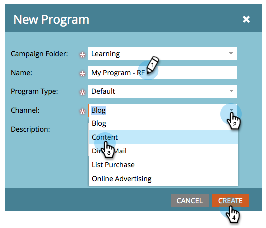
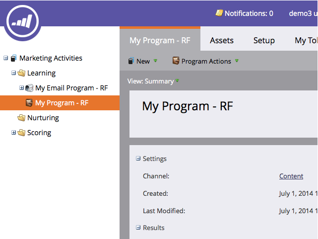

# 表單{#landing-page-with-a-form}的著陸頁面

## 任務：建立包含表單的登陸頁面以吸引新人。{#mission-create-a-landing-page-with-a-form-to-acquire-new-people}

>[!PREREQUISITES]
>
>[設定並新增人員](/help/marketo/getting-started/quick-wins/get-set-up-and-add-a-person.md)

## 步驟1:建立程式{#step-create-a-program}

1. 前往&#x200B;**行銷活動**&#x200B;區域。

   

1. 選擇在[上一個quick win](/help/marketo/getting-started/quick-wins/send-an-email.md)中建立的&#x200B;**Learning**&#x200B;資料夾。

   

1. 在&#x200B;**New**&#x200B;下，按一下&#x200B;**New Program**。

   

1. 輸入程式&#x200B;**名稱**，選擇&#x200B;**渠道**，然後按一下&#x200B;**建立**。

   >[!NOTE]
   >
   >在程式名稱的結尾加上您的縮寫簽名，讓它變得獨特。

   

   >[!NOTE]
   >
   >方案是一項特定的行銷計畫。 **channel**&#x200B;旨在做為傳送機制，例如網路研討會、贊助或線上廣告。 您可能會在下拉式清單中看到不同的渠道選項，視您自己的例項中可用的項目而定。 您也可以[建立您自己的頻道](/help/marketo/product-docs/administration/tags/create-a-program-channel.md)。

   

幹得漂亮！ 既然我們已建立程式，讓我們繼續並建立一些內容。

## 步驟2:建立表單{#step-create-a-form}

1. 在選取程式後，按一下&#x200B;**新增**，然後按一下&#x200B;**新增本機資產**。

   

1. 選擇&#x200B;**Form**。

   

1. 輸入&#x200B;**名稱**&#x200B;格式，然後按一下&#x200B;**建立**。

   

   >[!NOTE]
   >
   >請確定已選中&#x200B;**在編輯器中開啟**&#x200B;框。 如果沒有，您需要按一下「編輯表單」標籤。****

   >[!TIP]
   >
   >沒看到表格編輯器嗎？ 您的瀏覽器可能已封鎖視窗。 在您的瀏覽器中啟用[app.marketo.com](https://app.marketo.com/)的快顯視窗，然後按一下頂端功能表列中的「編輯草稿」。

1. 選擇「**電子郵件地址**」欄位，並選中「**Is Required**」。

   

1. 按一下&#x200B;**Next**。

   

1. 按一下箭頭以捲動主題。 選擇一個。

   

1. 按一下&#x200B;**Next**。

   

1. 在「感謝頁面」區段下，選擇&#x200B;**External URL**&#x200B;以取得&#x200B;**Follow Up With**。

   

1. 輸入URL。

   

   >[!NOTE]
   >
   >「後續頁面」是訪客填妥表單後重新導向的頁面。 外部URL是一個選項，但有更多選項。 請參閱[設定表單感謝頁面](/help/marketo/product-docs/demand-generation/forms/creating-a-form/set-a-form-thank-you-page.md)。

1. 按一下&#x200B;**完成**。

   

1. 按一下「核准並關閉」。****

   

   超級！ 現在，您有一個程式，其中包含表格。 讓我們繼續並建立頁面。

   

## 步驟3:建立著陸頁面並新增表單{#step-create-a-landing-page-and-add-your-form}

1. 在選取程式後，按一下「新增&#x200B;****」，然後按一下「新增本機資產&#x200B;**」。**

   

1. 選擇&#x200B;**著陸頁面**。

   

1. 輸入頁面&#x200B;**名稱**，選擇模板，然後按一下&#x200B;**建立**。

   >[!NOTE]
   >
   >您的範本可能與我們的螢幕擷取中的範本不同，沒關係，只要選一個，就可以繼續。

   

1. 著陸頁面編輯器開啟後，將「表單」元素拖曳至畫布。

   

1. 查找並選擇表單，然後按一下&#x200B;**插入**。

   

1. 將表單拖曳至所需位置。

   

1. 您的所有變更都會自動儲存。 關閉表單編輯器頁籤／窗口。

   

   幹得好！ 您現在有一個包含表單的登陸頁面。 讓我們核准您的頁面，讓它上線。

## 步驟4:批准您的著陸頁面{#step-approve-your-landing-page}

1. 在&#x200B;**著陸頁面動作**&#x200B;下，選取著陸頁面，按一下&#x200B;**批准**。

   >[!NOTE]
   >
   >核准登陸頁面將會讓其上線，並可在網際網路上存取。

   

   完美！ 看到綠色的勾號了嗎？

   

## 步驟5:測試表單{#step-test-your-form}

1. 選擇您的著陸頁面，然後按一下「檢視已核准的頁面」。****

   

1. 填寫您知道是唯一的資訊的表格，然後按一下「送出」。****

   

1. 轉至&#x200B;**Database**&#x200B;區域。

   

1. 搜尋填寫表單時使用的唯一電子郵件地址。

   

   就在這！ 您建立了新的登陸頁面，其上有表單，並使用它產生新人。

   

## 任務完成！{#mission-complete}

  

[◄發送電子郵件爆炸](/help/marketo/getting-started/quick-wins/send-an-email.md)

[簡易計分►](/help/marketo/getting-started/quick-wins/simple-scoring.md)
