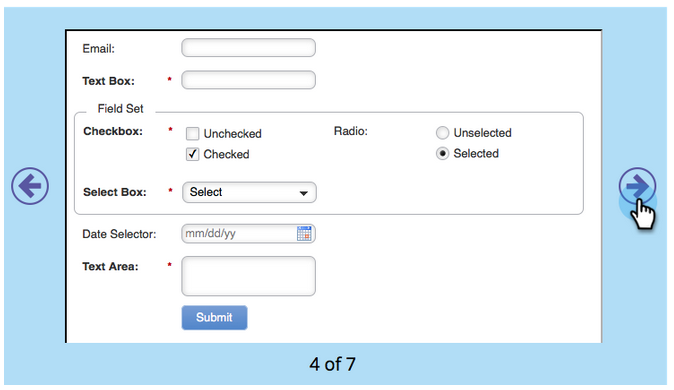

# 含有表單的登陸頁面 {#landing-page-with-a-form}

## 任務：建立具有表單的登陸頁面，以贏取新人員。 {#mission-create-a-landing-page-with-a-form-to-acquire-new-people}

>[!PREREQUISITES]
>
>[完成設定並新增人員](/help/marketo/getting-started/quick-wins/get-set-up-and-add-a-person.md)

## 步驟1：建立方案 {#step-create-a-program}

1. 前往 **[!UICONTROL 行銷活動]** 區域。

   

1. 選取 **學習** 資料夾建立於 [上一個快速獲勝](/help/marketo/getting-started/quick-wins/send-an-email.md){target="_blank"}. 在 **[!UICONTROL 新增]**，按一下 **[!UICONTROL 新計畫]**.

   

1. 輸入計畫 **[!UICONTROL 名稱]**，選取 **[!UICONTROL 頻道]**，然後按一下 **[!UICONTROL 建立]**.

   

   >[!TIP]
   >
   >在程式名稱的結尾加上您的縮寫，使其成為唯一。

   >[!NOTE]
   >
   >方案是一個特定的行銷計畫。 此 **頻道** 旨在作為傳遞機制，例如網路研討會、贊助或線上廣告。 根據您自己的執行個體中可用的專案，您可能會在下拉式清單中看到不同的管道選項。 您也可以 [建立您自己的頻道](/help/marketo/product-docs/administration/tags/create-a-program-channel.md){target="_blank"}.

做得很好！ 現在我們已建立程式，接著來建立一些內容。

## 步驟2：建立表單 {#step-create-a-form}

1. 選取您的程式後，按一下 **[!UICONTROL 新增]** 下拉式清單並選取 **[!UICONTROL 新增本機資產]**.

   

1. 選取 **[!UICONTROL 表單]**.

   

1. 輸入表單 **[!UICONTROL 名稱]** 並按一下 **[!UICONTROL 建立]**.

   

   >[!NOTE]
   >
   >請確定 **[!UICONTROL 在編輯器中開啟]** 方塊是否已勾選。 如果不是，您必須按一下 **[!UICONTROL 編輯表單]** 標籤。

   >[!TIP]
   >
   >看不到表單編輯器？ 您的瀏覽器可能封鎖了視窗。 啟用快顯視窗 `app.marketo.com` ，然後按一下頂端功能表列中的「編輯草稿」 。

1. 選取 **[!UICONTROL 電子郵件地址]** 欄位並檢查 **[!UICONTROL 為必要]**.

   

1. 按一下 **[!UICONTROL 下一個]**.

   

1. 按一下箭頭可捲動主題。 選取一項。

   

1. 按一下 **[!UICONTROL 下一個]**.

   

1. 在「感謝頁面」區段下，選取 **[!UICONTROL 外部URL]** 的 **[!UICONTROL 跟進]**.

   

1. 輸入URL。

   

   >[!NOTE]
   >
   >「後續追蹤頁面」是填寫表單後重新導向訪客的位置。 外部URL是一個選項，但還有更多選項。 另請參閱 [設定表單感謝頁面](/help/marketo/product-docs/demand-generation/forms/creating-a-form/set-a-form-thank-you-page.md){target="_blank"}.

1. 按一下 **[!UICONTROL 完成]**.

   

1. 按一下 **[!UICONTROL 核准並關閉]**.

   

   太棒了！ 現在您有一個包含表單的方案。 讓我們繼續並建立頁面。

## 步驟3：建立登入頁面並新增您的表單 {#step-create-a-landing-page-and-add-your-form}

1. 選取您的程式後，按一下 **[!UICONTROL 新增]** 下拉式清單並選取 **[!UICONTROL 新增本機資產]**.

   

1. 選取 **[!UICONTROL 登陸頁面]**.

   

1. 輸入頁面 **[!UICONTROL 名稱]**，選取範本並按一下 **[!UICONTROL 建立]**.

   >[!NOTE]
   >
   >您可能有與熒幕擷圖不同的範本，沒關係，只要選擇一個並繼續操作即可。

   

1. 登入頁面編輯器開啟後，拖曳 [!UICONTROL 表單] 元素貼到畫布上。

   

1. 尋找並選取您的表單，然後按一下 **[!UICONTROL 插入]**.

   

1. 將表單四處拖曳至所需位置。

   

1. 您的所有變更都會自動儲存。 關閉表單編輯器索引標籤/視窗。

   

   做得好！您現在已有一個包含表單的登入頁面。 讓我們核准您的頁面，讓它上線。

## 步驟4：核准您的登陸頁面 {#step-approve-your-landing-page}

1. 選取您的登入頁面並按一下 **[!UICONTROL 核准草稿]**.

   

   >[!NOTE]
   >
   >核准登入頁面後，系統就會將其上線並可在網際網路上存取。

   完美！ 看見上面綠色的勾號了嗎？

   

## 步驟5：測試表單 {#step-test-your-form}

1. 選取您的登入頁面並按一下 **[!UICONTROL 檢視已核准頁面]**.

   

1. 在表格中填入您知道的唯一資訊，然後按一下 **[!UICONTROL 提交]**.

   

1. 前往 **[!UICONTROL 資料庫]** 區域。

   

1. 搜尋您在填寫表單時使用的唯一電子郵件地址。

   

   在那裡！ 您已建立上面有表單的新登入頁面，並用來產生新人員。

   

## 任務完成！ {#mission-complete}

  

[◄任務1：傳送電子郵件爆炸郵件](/help/marketo/getting-started/quick-wins/send-an-email.md)

[任務3：簡單評分►](/help/marketo/getting-started/quick-wins/simple-scoring.md)
