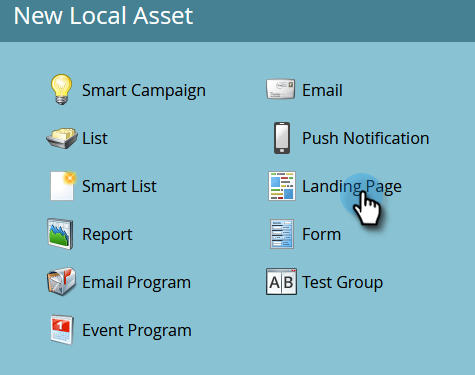
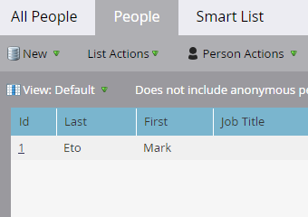

# 具有表單的登陸頁面 {#landing-page-with-a-form}

## 任務：使用表單建立登錄頁面以贏取新人員。 {#mission-create-a-landing-page-with-a-form-to-acquire-new-people}

>[!PREREQUISITES]
>
>[設定並新增人員](/help/marketo/getting-started/quick-wins/get-set-up-and-add-a-person.md)

## 步驟1:建立方案 {#step-create-a-program}

1. 前往 **行銷活動** 的上界。

   

1. 選取 **學習** 在 [上一次快速成功](/help/marketo/getting-started/quick-wins/send-an-email.md){target=&quot;_blank&quot;}。 在 **新增**，按一下 **新計畫**.

   

1. 輸入方案 **名稱**，選取 **管道**，然後按一下 **建立**.

   

   >[!TIP]
   >
   >在節目名稱的結尾加上您的縮寫，使其唯一。

   >[!NOTE]
   >
   >方案是一項特定的行銷計畫。 此 **頻道** 目的是提供傳遞機制，例如網路研討會、贊助或線上廣告。 視您自己的例項中可用的項目而定，下拉式清單中可能會顯示不同的管道選項。 您也可以 [建立您自己的管道](/help/marketo/product-docs/administration/tags/create-a-program-channel.md){target=&quot;_blank&quot;}。

幹得好！ 既然我們已建立程式，接下來就開始建立一些內容。

## 步驟2:建立表單 {#step-create-a-form}

1. 在選取您的方案後，按一下 **新增** 下拉式清單並選取 **新本機資產**.

   

1. 選擇 **表單**.

   

1. 輸入表單 **名稱** 按一下 **建立**.

   

   >[!NOTE]
   >
   >請確定 **在編輯器中開啟** 框。 若非如此，您將需要按一下 **編輯表單** 標籤。

   >[!TIP]
   >
   >沒看到表單編輯器嗎？ 您的瀏覽器可能已封鎖視窗。 從啟用快顯視窗 `app.marketo.com` 在瀏覽器中，按一下頂端功能表列中的「編輯草稿」 。

1. 選取 **電子郵件地址** 欄位和檢查 **為必要項目**.

   

1. 按一下 **下一個**.

   

1. 按一下箭頭以滾動主題。 選取一個。

   

1. 按一下 **下一個**.

   

1. 在感謝頁面區段下，選取 **外部URL** for **後續**.

   

1. 輸入URL。

   

   >[!NOTE]
   >
   >「後續頁面」是填寫表單後重新導向訪客的位置。 外部URL是一個選項，但有其他選項。 請參閱 [設定表單感謝頁面](/help/marketo/product-docs/demand-generation/forms/creating-a-form/set-a-form-thank-you-page.md){target=&quot;_blank&quot;}。

1. 按一下 **完成**.

   

1. 按一下 **核准並關閉**.

   

   太棒了！ 現在你有一個程式，裡面有表格。 讓我們繼續並建立頁面。

## 步驟3:建立登錄頁面並新增表單 {#step-create-a-landing-page-and-add-your-form}

1. 在選取您的方案後，按一下 **新增** 下拉式清單並選取 **新本機資產**.

   

1. 選擇 **登陸頁面**.

   

1. 輸入頁面 **名稱**，選取範本並按一下 **建立**.

   >[!NOTE]
   >
   >螢幕截圖中的模板可能不同，沒問題，只要選擇一個模板，然後繼續。

   

1. 登錄頁面編輯器開啟後，將「表單」元素拖曳至畫布上。

   

1. 尋找並選取您的表單，然後按一下 **插入**.

   

1. 將表單拖曳至所需位置。

   

1. 所有變更都會自動儲存。 關閉表單編輯器索引標籤/視窗。

   

   幹得好！ 您現在有一個登錄頁面，其中包含表單。 讓您的頁面上線。

## 步驟4:核准登錄頁面 {#step-approve-your-landing-page}

1. 選取您的登錄頁面，然後按一下 **核准草稿**.

   

   >[!NOTE]
   >
   >核准登錄頁面後，登錄頁面就會上線，並可供網際網路存取。

   完美！ 看到綠色勾號了嗎？

   

## 步驟5:測試您的表單 {#step-test-your-form}

1. 選取您的登錄頁面，然後按一下 **「查看已批准」頁**.

   

1. 填寫您知道的唯一資訊，然後按一下 **提交**.

   

1. 前往 **資料庫** 的上界。

   

1. 搜尋填寫表單時使用的唯一電子郵件地址。

   

   就這樣！ 您建立了含有表單的新登錄頁面，並用它產生新人員。

   

## 任務完成！ {#mission-complete}

  

[◄任務1:傳送電子郵件爆炸](/help/marketo/getting-started/quick-wins/send-an-email.md)

[任務3:簡單計分►](/help/marketo/getting-started/quick-wins/simple-scoring.md)
