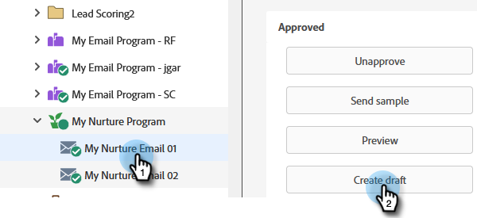
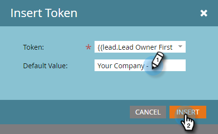

# 個人化電子郵件 {#personalize-an-email}

## 任務：新增資料代號，讓您的電子郵件成為個人電子郵件 {#mission-make-your-emails-personal-by-adding-data-tokens}

>[!PREREQUISITES]
>
>* [設定並新增人員](/help/marketo/getting-started/quick-wins/get-set-up-and-add-a-person.md){target=&quot;_blank&quot;}
>* [傳送電子郵件爆炸](/help/marketo/getting-started/quick-wins/send-an-email.md){target=&quot;_blank&quot;}
>* [滴水，滴水，撫育](/help/marketo/getting-started/quick-wins/drip-drip-nurture.md){target=&quot;_blank&quot;}

## 步驟1:選取要個人化的電子郵件 {#step-select-an-email-to-personalize}

1. 選取 [上一次快速成功](/help/marketo/getting-started/quick-wins/drip-drip-nurture.md){target=&quot;_blank&quot;}，按一下 **建立草稿**.

   

   >[!NOTE]
   >
   >這會以草稿形式建立電子郵件副本。 請記得核准草稿，變更才會上線。

如果您尚未啟用快顯封鎖程式，電子郵件編輯器將會在新索引標籤/視窗中開啟。 否則，按一下 **建立草稿** 兩次。

## 步驟2:將銷售人員設為寄件者 {#step-make-the-salesperson-the-sender}

1. 選取 **從** 欄位、突出顯示和 **刪除** 目前的名稱。

   

1. 按一下 **代號** 表徵圖 **從** 欄位。

   

1. 尋找並選取 **`{{lead.Lead Owner First Name}}`** 代號。

   

1. 輸入您的公司名稱，並加上破折號 **預設值** 以確保在銷售代表的名字不可用時顯示某些內容。 按一下 **插入**.

   

1. 點擊 **從** 欄位，確保游標在剛插入的令牌後閃爍一個空格。 然後按一下 **代號** 圖示。

   

1. 尋找並選取 **`{{lead.Lead Owner Last Name}}`** 代號。

   

1. 鍵入「Sales」 **預設值** 按一下 **插入**.

   

## 步驟3:將銷售機會名稱新增至電子郵件 {#step-add-the-leads-name-to-the-email}

1. 選取頂端可編輯的區段，按一下齒輪圖示並選取 **編輯**.

   

1. 在&quot;Hello&quot;後面添加一個空格，並將游標放在逗號前面，然後按一下 **插入代號** 表徵圖。

   

1. 尋找並選取 **`{{lead.First Name}}`** 代號。

   

1. 在 **預設值** 欄位，按一下 **插入**.

   

   >[!TIP]
   >
   >一律包含代號的預設值；這可確保在缺少部分個人資訊時，在電子郵件中顯示預設值。

1. 按一下 **儲存**.

   

1. 在 **電子郵件動作** 選取 **核准並關閉**.

   

>[!TIP]
>
>需要快速重新整理一下如何傳送電子郵件給您自己嗎？ 請參閱 [傳送電子郵件爆炸](/help/marketo/getting-started/quick-wins/send-an-email.md){target=&quot;_blank&quot;}。

### 任務完成 {#mission-complete}

恭喜，您的電子郵件已個性化！

  

[◄任務6:滴水，滴水，撫育](/help/marketo/getting-started/quick-wins/drip-drip-nurture.md)

[任務8:提醒銷售代表►](/help/marketo/getting-started/quick-wins/alert-the-sales-rep.md)
