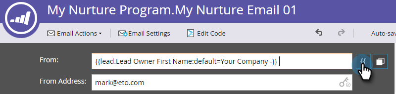

# 個人化電子郵件 {#personalize-an-email}

## 任務：新增資料代號，讓您的電子郵件更個人化 {#mission-make-your-emails-personal-by-adding-data-tokens}

>[!PREREQUISITES]
>
>* [完成設定並新增人員](/help/marketo/getting-started/quick-wins/get-set-up-and-add-a-person.md){target="_blank"}
>* [傳送電子郵件爆炸訊息](/help/marketo/getting-started/quick-wins/send-an-email.md){target="_blank"}
>* [滴答、滴答、培養](/help/marketo/getting-started/quick-wins/drip-drip-nurture.md){target="_blank"}

## 步驟1：選取要個人化的電子郵件 {#step-select-an-email-to-personalize}

1. 選取在中建立的其中一個Nurture電子郵件 [上一個快速獲勝](/help/marketo/getting-started/quick-wins/drip-drip-nurture.md){target="_blank"} 並按一下 **[!UICONTROL 建立草稿]**.

   

   >[!NOTE]
   >
   >這會建立電子郵件的副本作為草稿。 請記得核准草稿，讓變更生效。

如果您尚未啟用快顯封鎖程式，電子郵件編輯器將在新索引標籤/視窗中開啟。 否則，請按一下 **[!UICONTROL 建立草稿]** 兩次。

## 步驟2：將業務代表設為寄件者 {#step-make-the-salesperson-the-sender}

1. 選取 **[!UICONTROL 從]** 欄位，反白顯示和 **刪除** 目前名稱。

   

1. 按一下 **Token** 圖示右側 **[!UICONTROL 從]** 欄位。

   

1. 尋找並選取 **`{{lead.Lead Owner First Name}}`** token。

   

1. 輸入您的公司名稱和破折號 **預設值** 以確保在銷售代表的名字不可用時顯示某些內容。 按一下 **插入**.

   

1. 按一下中的空格鍵 **[!UICONTROL 從]** 欄位，確認游標在您剛剛插入的Token後閃爍一個空格。 然後按一下 **Token** 圖示重新顯示。

   

1. 尋找並選取 **`{{lead.Lead Owner Last Name}}`** token。

   

1. 鍵入&quot;Sales&quot; for **預設值** 並按一下 **插入**.

   

## 步驟3：將潛在客戶名稱新增至電子郵件 {#step-add-the-leads-name-to-the-email}

1. 選取頂端可編輯的區段，按一下齒輪圖示並選取 **[!UICONTROL 編輯]**.

   

1. 在「Hello」後面加上空格，並將游標放在逗號前面，然後按一下 **插入Token** 圖示。

   

1. 尋找並選取 **`{{lead.First Name}}`** token。

   

1. 在「 」中輸入「朋友」（或您想要的任何標籤） **[!UICONTROL 預設值]** 欄位並按一下 **[!UICONTROL 插入]**.

   

   >[!TIP]
   >
   >一律包含代號的預設值；這可確保在缺少部分個人資訊時，預設值將顯示在電子郵件中。

1. 按一下 **[!UICONTROL 儲存]**.

   

1. 下 **[!UICONTROL 電子郵件動作]** 並選取 **[!UICONTROL 核准並關閉]**.

   

>[!TIP]
>
>需要快速複習如何傳送電子郵件給您自己？ 另請參閱 [傳送電子郵件爆炸訊息](/help/marketo/getting-started/quick-wins/send-an-email.md){target="_blank"}.

### 任務完成 {#mission-complete}

恭喜，您已個人化您的電子郵件！

  

[◄任務6：滴水、滴水、Nurture](/help/marketo/getting-started/quick-wins/drip-drip-nurture.md)

[任務8：通知銷售代表►](/help/marketo/getting-started/quick-wins/alert-the-sales-rep.md)
