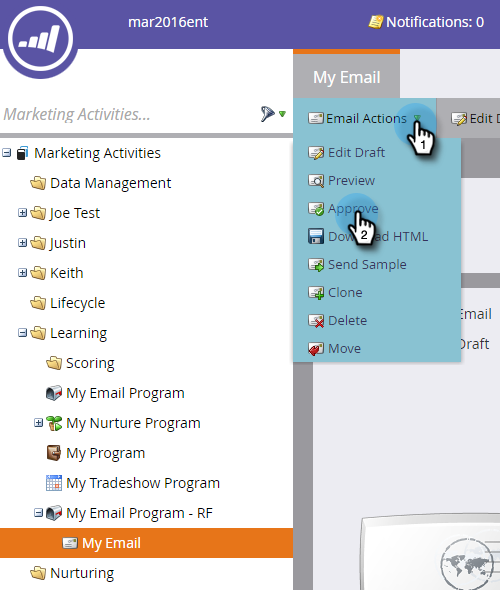

# 傳送電子郵件{#send-an-email}

這是每個人都想做的第一件事。 我們從Marketo發郵件吧！

>[!PREREQUISITES]
>
>[設定並新增人員](/help/marketo/getting-started/quick-wins/get-set-up-and-add-a-person.md)

## 建立電子郵件程式{#create-an-email-program}

1. 前往&#x200B;**行銷活動**&#x200B;區域。

   

1. 選擇&#x200B;**Learning**&#x200B;資料夾。 按一下&#x200B;**新建**&#x200B;下拉清單並選擇&#x200B;**新建程式**。

   

1. 輸入&#x200B;**名稱**，並選擇&#x200B;**電子郵件**&#x200B;作為&#x200B;**程式類型。**

   >[!TIP]
   >
   >在程式名稱的結尾加上您的縮寫簽名，讓它變得獨特。

   

1. 在&#x200B;**Channel**&#x200B;下，選擇&#x200B;**電子郵件發送**&#x200B;並按一下&#x200B;**建立**。

   

## 定義您的對象{#define-your-audience}

1. 按一下「對象」方塊下的「編輯智慧型清單」。****

   

1. 尋找「電子郵件地址」篩選器並拖曳至畫布中。

   

   >[!TIP]
   >
   >使用「篩選」清單頂端的&#x200B;**搜尋**，更輕鬆地尋找篩選。

1. 尋找並選取您的電子郵件地址。

   

   >[!NOTE]
   >
   >如果您的電子郵件未自動填入，您可能忘記[設定並新增銷售線索。](/help/marketo/getting-started/quick-wins/get-set-up-and-add-a-person.md)

   >[!NOTE]
   >
   >在此範例中，我們讓您只傳送電子郵件給自己，但您可以視需要自訂對象。

1. 返回主程式頁籤，按一下&#x200B;**Person**&#x200B;的刷新表徵圖。

   

   你應該看到人數最多1 就是你！

## 建立電子郵件{#create-an-email}

1. 在「電子郵件」表徵圖下，按一下「新建電子郵件」。****

   

1. 輸入&#x200B;**名稱**，選擇&#x200B;**模板**，然後按一下&#x200B;**建立**。

   

1. 將會開啟電子郵件編輯器窗口。 輸入50個或更少字元的主旨（建議）。

   

   >[!NOTE]
   >
   >如果您有快顯封鎖程式，請按一下「編輯草稿&#x200B;**」以輸入電子郵件編輯器。**

1. 選擇要編輯的區域，按一下右側的齒輪表徵圖，然後選擇&#x200B;**編輯**（您也可以按兩下可編輯的部分進行編輯）。

   

1. 輸入所需內容，然後按一下「保存」。****

   

1. 變更將自動儲存。 關閉編輯器頁籤／窗口。

   

1. 按一下「電子郵件動作&#x200B;**」下拉式清單，然後選取「核准**」。****

   

   >[!TIP]
   >
   >想要在啟動之前，先自行傳送範例，瞭解您的電子郵件外觀嗎？ 在上面的菜單中選擇&#x200B;**發送示例** ，或按一下&#x200B;**電子郵件操作** ，然後選擇&#x200B;[**發送示例**](/help/marketo/product-docs/email-marketing/general/creating-an-email/send-a-sample-email.md)。

1. 在左樹中選擇「電子郵件程式」。

   

1. 在「排程」方塊下，將電子郵件的啟動日設為&#x200B;**今天。**

   

1. 選取未來至少15分鐘的時間。

   

   >[!TIP]
   >
   >預設時區不是您的時區嗎？ 瞭解如何在此處[更新](/help/marketo/product-docs/administration/settings/select-your-language-locale-and-time-zone.md)。

1. 按一下「批准」表徵圖下的「批准程式」(**Approve Program)**，您就完成了！

   

您應該會在排程的日／時間後不久收到電子郵件。

  

[◄設定和添加線索](/help/marketo/getting-started/quick-wins/get-set-up-and-add-a-person.md)

[包含表單►的著陸頁面](/help/marketo/getting-started/quick-wins/landing-page-with-a-form.md)
