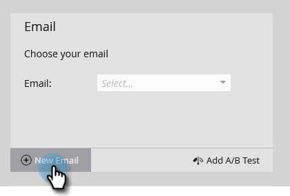

# 傳送電子郵件 {#send-an-email}

這是每個人都想做的第一件事。 讓我們從Marketo傳送電子郵件！

>[!PREREQUISITES]
>
>[完成設定並新增人員](/help/marketo/getting-started/quick-wins/get-set-up-and-add-a-person.md){target="_blank"}

## 建立電子郵件程式 {#create-an-email-program}

1. 前往 **[!UICONTROL 行銷活動]** 區域。

   

1. 選取您的 **[!UICONTROL 學習]** 資料夾。 按一下 **[!UICONTROL 新增]** 下拉式清單並選取 **[!UICONTROL 新計畫]**.

   

1. 輸入 **[!UICONTROL 名稱]** 並選取 **[!UICONTROL 電子郵件]** 的 **[!UICONTROL 計畫型別]**.

   >[!TIP]
   >
   >在程式名稱的結尾處新增您的縮寫，使其成為唯一的。

   

1. 下 **[!UICONTROL 頻道]**，選取 **[!UICONTROL 電子郵件傳送]** 並按一下 **[!UICONTROL 建立]**.

   

## 定義您的對象 {#define-your-audience}

1. 按一下 **[!UICONTROL 編輯智慧清單]** 在 [!UICONTROL 對象] 圖磚。

   

1. 尋找並拖曳 [!UICONTROL 電子郵件地址] 篩選至畫布上。

   

   >[!TIP]
   >
   >使用 **[!UICONTROL 搜尋]** 函式以更輕鬆地找到篩選器。

1. 尋找並選取您的電子郵件地址。

   

   >[!NOTE]
   >
   >如果您的電子郵件未自動填入，表示您可能忘了 [完成設定並新增銷售機會。](/help/marketo/getting-started/quick-wins/get-set-up-and-add-a-person.md){target="_blank"}

   >[!NOTE]
   >
   >在此範例中，我們要求您僅將電子郵件傳送給您自己，但您可以視需要自訂對象。

1. 返回主要程式索引標籤，然後按一下重新整理圖示 **[!UICONTROL 個人]**.

   

   您應該會看到人員計數上升到1。 就是您！

## 建立電子郵件 {#create-an-email}

1. 在「電子郵件」圖磚下，按一下 **[!UICONTROL 新電子郵件]**.

   

1. 輸入 **[!UICONTROL 名稱]**，選取 **範本**，然後按一下 **[!UICONTROL 建立]**.

   

1. 將會開啟電子郵件編輯器視窗。 輸入不超過50個字元的主旨（建議使用）。

   

   >[!NOTE]
   >
   >如果您有快顯封鎖程式，請按一下 **[!UICONTROL 編輯草稿]** 以輸入電子郵件編輯器。

1. 選取您要編輯的區域，按一下右側的齒輪圖示，然後選取 **[!UICONTROL 編輯]** （您也可以連按兩下可編輯的區段來編輯）。

   

1. 輸入您想要的內容，然後按一下 **[!UICONTROL 儲存]**.

   

1. 按一下 **[!UICONTROL 電子郵件動作]** 下拉式清單並選取 **[!UICONTROL 核准並關閉]**.

   

   >[!TIP]
   >
   >想要傳送快速範例給您自己，以檢視您的電子郵件在啟動前的外觀嗎？ 選取 **[!UICONTROL 傳送範例]** ，或按一下 **[!UICONTROL 電子郵件動作]** 則 [**[!UICONTROL 傳送範例]**](/help/marketo/product-docs/email-marketing/general/creating-an-email/send-a-sample-email.md){target="_blank"}.

1. 在左側樹狀結構中選取電子郵件程式。

   

1. 在 [!UICONTROL 排程] 圖磚，將電子郵件的啟動日設為 **[!UICONTROL 今天]**.

   

   >[!NOTE]
   >
   >進一步瞭解 [收件者時區](/help/marketo/product-docs/email-marketing/email-programs/email-program-actions/scheduling-with-recipient-time-zone/schedule-email-programs-with-recipient-time-zone.md){target="_blank"} and [Head Start](/help/marketo/product-docs/email-marketing/email-programs/email-program-actions/head-start-for-email-programs.md){target="_blank"}.

1. 選取未來至少15分鐘的時間。

   

   >[!TIP]
   >
   >預設時區不是您的時區嗎？ 瞭解如何 [在此處更新](/help/marketo/product-docs/administration/settings/select-your-language-locale-and-time-zone.md){target="_blank"}.

1. 按一下 **[!UICONTROL 核准方案]** 在 [!UICONTROL 核准] 圖磚，您就可以完成了！

   

您應在排程的日/時間後不久收到電子郵件。

## 任務完成！ {#mission-complete}

  

[◄一下設定並新增人員](/help/marketo/getting-started/quick-wins/get-set-up-and-add-a-person.md)

[任務2：含表單頁►的登陸頁面](/help/marketo/getting-started/quick-wins/landing-page-with-a-form.md)
