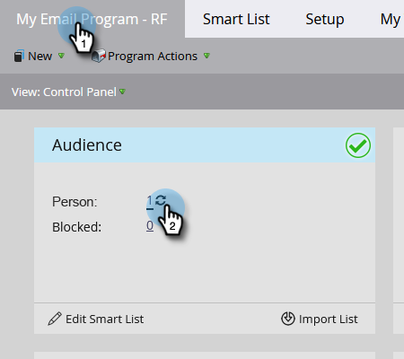

# 傳送電子郵件 {#send-an-email}

這是每個人都想做的第一件事。從 Marketo 傳送電子郵件！

>[!PREREQUISITES]
>
>[完成設定與新增人員](/help/marketo/getting-started/quick-wins/get-set-up-and-add-a-person.md){target="_blank"}

## 建立電子郵件方案 {#create-an-email-program}

1. 前往「**[!UICONTROL Marketing Activities]**」區域。

   

1. 選取您的「**[!UICONTROL Learning]**」資料夾。按一下「**[!UICONTROL New]**」下拉式選單，選取「**[!UICONTROL New Program]**」。

   

1. 輸入「**[!UICONTROL Name]**」，並在「**[!UICONTROL Program Type]**」選取「**[!UICONTROL Email]**」。

   >[!TIP]
   >
   >在方案名稱的最後加入您的姓名縮寫，使其變得獨一無二。

   

1. 在「**[!UICONTROL Channel]**」之下，選取「**[!UICONTROL Email Send]**」，然後按一下「**[!UICONTROL Create]**」。

   

## 定義您的客群 {#define-your-audience}

1. 按一下「[!UICONTROL Audience]」圖磚之下的「**[!UICONTROL Edit Smart List]**」。

   

1. 找到「[!UICONTROL Email Address]」篩選器，將其拖曳至版面上。

   

   >[!TIP]
   >
   >使用「**[!UICONTROL Search]**」功能可以更輕鬆地找到篩選器。

1. 找到並選取您的電子郵件地址。

   

   >[!NOTE]
   >
   >若電子郵件沒有自動填入，可能是您忘了[完成設定與新增商機。](/help/marketo/getting-started/quick-wins/get-set-up-and-add-a-person.md){target="_blank"}

   >[!NOTE]
   >
   >在這個範例中，您只會傳送電子郵件給自己，但您可以根據需求自訂客群。

1. 回到主方案索引標籤，按一下「**[!UICONTROL Person]**」的重新整理圖示。

   

   您應該會看到人數增加為 1。那就是您！

## 建立電子郵件 {#create-an-email}

1. 在電子郵件圖磚之下，按一下「**[!UICONTROL New Email]**」。

   

1. 輸入「**[!UICONTROL Name]**」，選取一個&#x200B;**範本**，然後按一下「**[!UICONTROL Create]**」。

   

1. 電子郵件編輯器視窗便會開啟。輸入 50 個字元以內 (建議字數) 的主旨。

   

   >[!NOTE]
   >
   >若您有使用快顯視窗封鎖程式，請按一下「**[!UICONTROL Edit Draft]**」進入電子郵件編輯器。

1. 選取要編輯的區域，按一下右側的齒輪圖示，然後選取「**[!UICONTROL Edit]**」(也可以按兩下可編輯的區段進行編輯)。

   

1. 輸入您想要的內容，按一下「**[!UICONTROL Save]**」。

   

1. 按一下「**[!UICONTROL Email Actions]**」下拉式選單，選取「**[!UICONTROL Approve and Close]**」。

   

   >[!TIP]
   >
   >想要在電子郵件正式發送之前，先傳送簡短的樣本給自己，以便檢視電子郵件呈現的樣貌？選取上方選單中的「**[!UICONTROL Send Sample]**」，或按一下「**[!UICONTROL Email Actions]**」然後「[**[!UICONTROL Send Sample]**](/help/marketo/product-docs/email-marketing/general/creating-an-email/send-a-sample-email.md){target="_blank"}」。

1. 選取左側樹狀結構內的電子郵件方案。

   

1. 在「[!UICONTROL Schedule]」圖磚之下，將電子郵件的發送日期設定為「**[!UICONTROL Today]**」。

   

   >[!NOTE]
   >
   >了解更多關於[收件者時區](/help/marketo/product-docs/email-marketing/email-programs/email-program-actions/scheduling-with-recipient-time-zone/schedule-email-programs-with-recipient-time-zone.md){target="_blank"}和[提前開始](/help/marketo/product-docs/email-marketing/email-programs/email-program-actions/head-start-for-email-programs.md){target="_blank"}的資訊。

1. 選取一個時間，其距離現在至少 15 分鐘後。

   

   >[!TIP]
   >
   >預設時區不是您的時區嗎？關於[如何更新請參閱這裡](/help/marketo/product-docs/administration/settings/select-your-language-locale-and-time-zone.md){target="_blank"}。

1. 按一下「[!UICONTROL Approval]」圖磚之下的「**[!UICONTROL Approve Program]**」，這樣就完成了！

   

您應該很快便會在排定的日期/時間後收到電子郵件。

## 任務完成！ {#mission-complete}

 

[◄ 完成設定與新增人員](/help/marketo/getting-started/quick-wins/get-set-up-and-add-a-person.md)

[任務 2：附有表單的登陸頁面 ►](/help/marketo/getting-started/quick-wins/landing-page-with-a-form.md)
