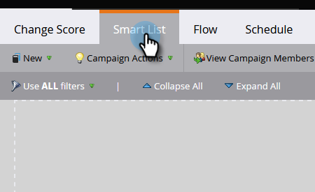
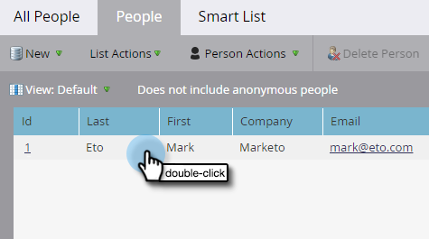

# 簡單計分 {#simple-scoring}

>[!PREREQUISITES]
>
>* [設定並添加人員](/help/marketo/getting-started/quick-wins/get-set-up-and-add-a-person.md){target="_blank"}
>* [帶表單的登錄頁](/help/marketo/getting-started/quick-wins/landing-page-with-a-form.md){target="_blank"}

## 步驟1:建立評分市場活動 {#step-create-a-scoring-campaign}

1. 轉到 **[!UICONTROL 營銷活動]** 的子菜單。

   

1. 按一下右鍵 **學習** 資料夾，按一下 **[!UICONTROL 新建市場活動資料夾]**。

   

1. 將市場活動資料夾命名為「評分」，然後按一下 **[!UICONTROL 建立]**。

   

   >[!NOTE]
   >
   >如果您已經有「評分」資料夾，請將此資料夾命名為其他內容，如「評分1」。 資料夾名稱必須唯一。

1. 按一下右鍵 **評分** 資料夾和 **[!UICONTROL 新智慧營銷]**。

   

1. 將市場活動命名為「更改分數」，然後按一下 **[!UICONTROL 建立]**。

   

1. 按一下 **[!UICONTROL 智慧清單]** 頁籤。

   

   我們希望每當某個人填寫您的 **試用申請表**。

1. 查找並拖動 **[!UICONTROL 填出窗體]** 觸發到左畫布上。

   

1. 選擇 **我的表格**。

   

   >[!NOTE]
   >
   >如果完成 [帶表單的登錄頁](/help/marketo/getting-started/quick-wins/landing-page-with-a-form.md){target="_blank"} 快贏，你應該有表格。 如果您為表單使用了其他名稱，請選擇該名稱。

1. 按一下 **[!UICONTROL 流]** 頁籤。

   

1. 拖動 **更改分數** 將操作移到左側畫布上。

   

1. 您可以鍵入任何值以添加到人員的分數。 讓我們在中輸入「+5」 **[!UICONTROL 更改]** 的子菜單。

   

   >[!TIP]
   >
   >良好的打分活動是為銷售人員提供高質量人員的關鍵。 閱讀 [**《最終線索評分指南》**](https://www.marketo.com/definitive-guides/lead-scoring/){target="_blank"}。

1. 按一下 **[!UICONTROL 計畫]** 頁籤 **[!UICONTROL 激活]** 按鈕

   

1. 按一下 **[!UICONTROL 激活]** 確認螢幕上。

   

>[!NOTE]
>
>一旦激活，此市場活動將在每次人員填寫表單時運行。 這個活動會一直進行到停用為止。

## 步驟2:填寫表單 {#step-fill-out-the-form}

1. 選擇在 [帶表單的登錄頁](/help/marketo/getting-started/quick-wins/landing-page-with-a-form.md){target="_blank"} 快贏。

   

1. 按一下 **[!UICONTROL 預覽]**。 登錄頁將在新頁籤中開啟。

   

1. 用您的名字、姓氏和電子郵件地址填寫表單，然後按一下 **[!UICONTROL 提交]**。

   

   >[!NOTE]
   >
   >使用您作為個人首次輸入時使用的相同名稱和電子郵件地址，以應用「+5」分數增加。

## 第3步：查看人員資訊 {#step-view-the-person-info}

1. 轉到 **[!UICONTROL 資料庫]** 的子菜單。

   

1. 搜索填寫表單時使用的電子郵件地址。

   

1. 按兩下您的人。

   

您的人員詳細資訊將在新頁籤或窗口中開啟。 看看填表時你的分數是如何增加5分的？

## 任務完成！ {#mission-complete}

  

[◄任務2:帶表單的登錄頁](/help/marketo/getting-started/quick-wins/landing-page-with-a-form.md)

[任務4:電子郵件自動響►](/help/marketo/getting-started/quick-wins/email-auto-response.md)
