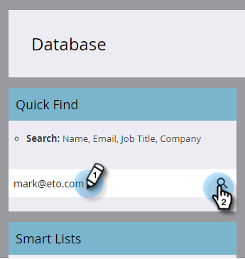

# 簡單評分 {#simple-scoring}

>[!PREREQUISITES]
>
>* [完成設定並新增人員](/help/marketo/getting-started/quick-wins/get-set-up-and-add-a-person.md){target="_blank"}
>* [含有表單的登陸頁面](/help/marketo/getting-started/quick-wins/landing-page-with-a-form.md){target="_blank"}

## 步驟1：建立評分行銷活動 {#step-create-a-scoring-campaign}

1. 前往 **[!UICONTROL 行銷活動]** 區域。

   

1. 用滑鼠右鍵按一下 **學習** 資料夾並按一下 **[!UICONTROL 新增Campaign資料夾]**.

   

1. 將行銷活動資料夾命名為「評分」，然後按一下 **[!UICONTROL 建立]**.

   

   >[!NOTE]
   >
   >如果您已經有評分資料夾，請為這個資料夾命名其他名稱，例如評分1。 資料夾名稱必須是唯一的。

1. 用滑鼠右鍵按一下 **評分** 資料夾並選取 **[!UICONTROL 新增Smart Campaign]**.

   

1. 將行銷活動命名為「Change Score」並按一下 **[!UICONTROL 建立]**.

   

1. 按一下 **[!UICONTROL 智慧清單]** 標籤。

   

   我們希望此行銷活動在有人填寫您的 **試用申請表**.

1. 尋找並拖曳 **[!UICONTROL 填寫表單]** 觸發至左側畫布。

   

1. 選取 **我的表單**.

   

   >[!NOTE]
   >
   >如果您已完成 [含有表單的登陸頁面](/help/marketo/getting-started/quick-wins/landing-page-with-a-form.md){target="_blank"} 快速獲勝，您應該要有表單。 如果您對表單使用不同的名稱，請選取該名稱。

1. 按一下 **[!UICONTROL 流量]** 標籤。

   

1. 拖曳 **變更分數** 將動作移到左側畫布。

   

1. 您可以輸入任何值以新增至個人的分數。 讓我們在「 」中輸入「+5」 **[!UICONTROL 變更]** 欄位。

   

   >[!TIP]
   >
   >良好的評分行銷活動是向銷售人員提供高品質人員的關鍵。 讀取 [**潛在客戶評分的最終指南**](https://www.marketo.com/definitive-guides/lead-scoring/){target="_blank"}.

1. 按一下 **[!UICONTROL 排程]** 標籤和 **[!UICONTROL 啟動]** 按鈕。

   

1. 按一下 **[!UICONTROL 啟動]** 確認畫面上。

   

>[!NOTE]
>
>一旦啟用，此行銷活動就會在每次有人填寫表單時執行。 行銷活動將持續執行直至停用。

## 步驟2：填寫表單 {#step-fill-out-the-form}

1. 選取您在「 」中建立的登入頁面 [含有表單的登陸頁面](/help/marketo/getting-started/quick-wins/landing-page-with-a-form.md){target="_blank"} 快速獲勝。

   

1. 按一下 **[!UICONTROL 預覽]**. 登入頁面將在新標籤中開啟。

   

1. 使用您的名字、姓氏和電子郵件地址填寫表單，然後按一下 **[!UICONTROL 提交]**.

   

   >[!NOTE]
   >
   >請使用您第一次以個人身份輸入時使用的相同名稱和電子郵件地址，以套用「+5」分數增加。

## 步驟3：檢視人員資訊 {#step-view-the-person-info}

1. 前往 **[!UICONTROL 資料庫]** 區域。

   

1. 搜尋您在填寫表單時使用的電子郵件地址。

   

1. 連按兩下您的人員。

   

您的個人詳細資訊將在新標籤或視窗中開啟。 看看您的分數在填寫表單時如何增加5分？

## 任務完成！ {#mission-complete}

  

[◄任務2：含表單的登陸頁面](/help/marketo/getting-started/quick-wins/landing-page-with-a-form.md)

[任務4：電子郵件自動回應►](/help/marketo/getting-started/quick-wins/email-auto-response.md)
