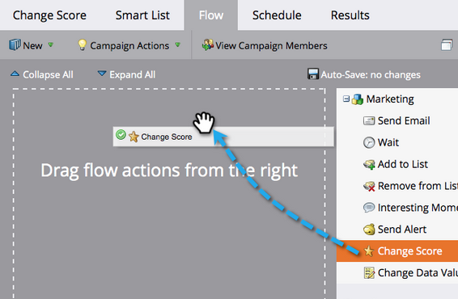

# 簡單計分 {#simple-scoring}

>[!PREREQUISITES]
>
>* [設定並新增人員](/help/marketo/getting-started/quick-wins/get-set-up-and-add-a-person.md){target=&quot;_blank&quot;}
>* [具有表單的登陸頁面](/help/marketo/getting-started/quick-wins/landing-page-with-a-form.md){target=&quot;_blank&quot;}

## 步驟1:建立計分促銷活動 {#step-create-a-scoring-campaign}

1. 前往 **行銷活動** 的上界。

   

1. 以滑鼠右鍵按一下 **學習** 資料夾，按一下 **新增促銷活動資料夾**.

   

1. 將促銷活動資料夾命名為「Scoring」，然後按一下 **建立**.

   

   >[!NOTE]
   >
   >如果您已有「計分」資料夾，請將此資料夾命名為其他名稱，例如「計分1」。 資料夾名稱必須是唯一的。

1. 以滑鼠右鍵按一下 **分數** 資料夾和選取 **新智慧型行銷活動**.

   

1. 將促銷活動命名為「變更分數」，然後按一下 **建立**.

   

1. 按一下 **智慧清單** 標籤。

   

   我們希望每當有人填滿您的 **試用申請表**.

1. 尋找並拖曳 **填寫表單** 觸發至左側畫布。

   

1. 選擇 **我的表單**.

   

   >[!NOTE]
   >
   >如果您已完成 [具有表單的登陸頁面](/help/marketo/getting-started/quick-wins/landing-page-with-a-form.md){target=&quot;_blank&quot;}快速贏取，您應該有表單。 如果您對表單使用不同名稱，請選取該名稱。

1. 按一下 **流量** 標籤。

   

1. 拖曳 **變更分數** 流動動作到左側畫布。

   

1. 您可以輸入任何值以新增至人員的分數。 在 **變更** 欄位。

   

   >[!TIP]
   >
   >良好的打分促銷活動是為銷售人員提供高質量人員的關鍵。 閱讀 [**領先評分的最終指南**](https://www.marketo.com/definitive-guides/lead-scoring/){target=&quot;_blank&quot;}。

1. 按一下 **排程** 標籤和 **啟動** 按鈕。

   

1. 按一下 **啟動** 在確認畫面上。

   

>[!NOTE]
>
>一旦啟用，每次有人填寫表單時，就會執行此促銷活動。 促銷活動會持續執行，直到停用為止。

## 步驟2:填寫表格 {#step-fill-out-the-form}

1. 選取您在 [具有表單的登陸頁面](/help/marketo/getting-started/quick-wins/landing-page-with-a-form.md){target=&quot;_blank&quot;}快速贏取。

   

1. 按一下 **預覽**. 登錄頁面將在新索引標籤中開啟。

   

1. 填寫您的名字、姓氏和電子郵件地址，然後按一下 **提交**.

   

   >[!NOTE]
   >
   >請使用您初次以個人身分輸入時所使用的相同名稱和電子郵件地址，以套用「+5」分數增加。

## 步驟3:檢視人員資訊 {#step-view-the-person-info}

1. 轉到「資料庫」區域。

   

1. 搜尋您在填寫表單時使用的電子郵件地址。

   

1. 按兩下你的人。

   

您的人員詳細資訊將在新索引標籤或視窗中開啟。 看看填表格的分數增加了5分嗎？

## 任務完成！ {#mission-complete}

  

[◄任務2:具有表單的登陸頁面](/help/marketo/getting-started/quick-wins/landing-page-with-a-form.md)

[任務4:電子郵件自動回應►](/help/marketo/getting-started/quick-wins/email-auto-response.md)
