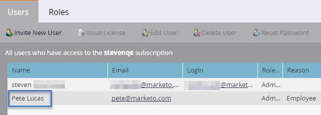

# 設定步驟 {#setup-steps}

**歡迎Marketo Engage!**

開始使用Marketo之前，您需先完成一些步驟。

這些步驟包括：

* 一些基本帳戶設定
* 將登錄頁面URL和電子郵件連結品牌化，以提升信任度和傳遞能力
* 同步您的CRM
* 新增追蹤代碼至您的公司網站

>[!NOTE]
>
>只有在您的公司 **新Marketo**. 否則，可能已完成設定。

某些步驟需要IT團隊的協助。

>[!TIP]
>
>若您 [打印此檢查清單](/help/marketo/getting-started/setup/setup-checklist.md){target="_blank"}，您可以在完成項目時將其勾選。

## 登入並建立其他Marketo使用者 {#log-in-and-create-additional-marketo-users}

1. 登入Marketo [此處](https://app.marketo.com/){target="_blank"} 使用電子郵件收到的憑證。

   

恭喜！你現在在Marketo，可以開始探索。 您可能想要邀請行銷團隊的同事加入。 您可以新增使用者來完成此操作。

前往 **管理** 的上界。

>[!TIP]
>
>在此時，您可以按一下 **我的帳戶** 更改帳戶和位置設定，以及設定新的訂閱名稱。

>[!NOTE]
>
>**需要管理權限**

按一下 **使用者與角色**.

按一下 **邀請新用戶**.

填寫同事的電子郵件地址、名字和姓氏。 _設定存取到期日為選用_. 按一下 **下一個**.

>[!TIP]
>
>到期日對於短期外部持份者或顧問而言是件好事，只需短暫存取Marketo即可。

>[!NOTE]
>
>到達到期日時，使用者會收到到期通知，且帳戶會遭鎖定。

選取角色，然後按一下 **下一個**. 標準使用者可存取除管理員以外的所有區域。

>[!NOTE]
>
>除了五個內建角色外，您也可以建立自訂角色。 深入了解 [管理使用者角色和權限](/help/marketo/product-docs/administration/users-and-roles/managing-user-roles-and-permissions.md){target="_blank"}.

您可以隨意調整邀請文字。 按一下 **傳送**.

新使用者現在會列在「使用者」索引標籤中，應該會收到包含建立密碼和登入連結的電子郵件。 下一步！

## 設定授權支援聯繫人 {#set-up-your-authorized-support-contacts}

您可能收到Marketo支援的電子郵件，指出您是貴公司的Marketo客戶支援管理員。 如果是，您可以設定 **授權支援聯繫人** 為你的團隊。 只有授權支援聯絡人才能直接透過 [Marketo支援入口網站](https://support.marketo.com){target="_blank"}.

>[!NOTE]
>
>您可以建立的支援聯絡人數取決於您購買的套件。 此限制會在您來自Marketo支援的電子郵件中指定。

授權支援連絡檔案已移至Marketo社群。 請參閱 [這篇文章](https://nation.marketo.com/t5/Knowledgebase/Managing-Authorized-Support-Contacts/ta-p/254341){target="_blank"}.

>[!NOTE]
>
>只有已登入Marketo社群的人才會出現在清單中。 如果找不到該人員，請確定他們先登入社群。

## 使用CNAME自訂您的登錄頁面URL {#customize-your-landing-page-urls-with-a-cname}

>[!NOTE]
>
>您是Launch Pack客戶嗎？ 您可以略過此步驟。 您的顧問會在您的啟動呼叫期間提供IT設定指示檔案。

>[!NOTE]
>
>**需要管理權限**

為您的登錄頁面選擇CNAME。 一些範例：

    * **go**。[CompanyDomain].com
    * **www2**。[CompanyDomain].com
    * **lp**。[CompanyDomain].com

>[!TIP]
>
>保持簡短！ 較短的URL更容易記住。 我們建議把「去」作為網域。

第一部分（以粗體顯示）為 `[LandingPageCNAME]`. 您在步驟5中需要它。

若要擷取要以登錄頁面CNAME取代的Munchkin ID，請前往「管理員」區域。

按一下 **我的帳戶**.

向下捲動至「支援資訊」，並複製您的Munchkin ID。

這是 `[Munchkin ID]`. 保存。 您需要在步驟5中將其提供給IT。

設定您的網域設定，讓登錄頁面使用您公司的網域，而非Marketo的網域（托管位置）。

## 確保電子郵件傳遞 {#ensure-email-deliverability}

>[!NOTE]
>
>您是Launch Pack客戶嗎？ 您可以略過此步驟。 您的顧問會在您的啟動呼叫期間提供IT設定指示檔案。

您可以採取數種措施，確保電子郵件能觸及盡可能多的使用者。

* **為追蹤連結加上品牌**. 您可以在來自Marketo的電子郵件中包含的連結中，選擇CNAME以使用您自己的網域(而非Marketo的網域)。 這可強化您的網域品牌，並提升與收件者的信任和傳遞能力。
* **將Marketo新增至您的公司電子郵件允許清單。** 在傳送電子郵件給實際人員之前，先傳送測試電子郵件給測試帳戶是常見的最佳作法。 允許列出Marketo，即可防止這些測試電子郵件遭到封鎖或標示為垃圾訊息。
* **設定SPF和DKIM。** 這些技術可確保收件者，您的Marketo電子郵件不會是垃圾郵件。 若要協助防止收件者的垃圾郵件篩選器拒絕您的Marketo電子郵件，請依照下列步驟執行 [設定電子郵件傳遞的SPF和DKIM](/help/marketo/product-docs/email-marketing/deliverability/set-up-spf-and-dkim-for-your-email-deliverability.md).
* **為域設定MX記錄。** MX記錄允許您接收到發送電子郵件到處理回復和自動應答器的域的郵件。 如果您要從公司網域傳送，您可能已設定此設定。 如果沒有，您通常可以設定為對應到您公司域的MX記錄。
* **寄件者地址的建議設定。** 您必須在所有電子郵件促銷活動的「寄件者地址」中使用有效、現有和有效的電子郵件網域。 設定公司網域的子網域，而非從公司網域傳送，可能會有所助益。 這可確保來自您公司郵件流的問題不會影響您的Marketo郵件流，反之亦然。 此外，從 `something@nonexistentdomain.com` 會導致電子郵件遭到篩選或封鎖。 發件人的「寄件人地址」中使用的任何域都必須具有有效且有效的postmaster@和upuse@帳戶。

如果您使用Google應用程式來托管公司電子郵件，將無法在您的網域下建立ubuse@或postmaster@電子郵件。 若要解決此問題，您需要建立名為「濫用」和「postmaster」的群組。 屬於這些群組成員的使用者會收到傳送至這些位址的電子郵件(例如postmaster@domain.com)。 如需建立群組的詳細指示，請參閱 [此處](https://support.google.com/a/answer/33343#adminconsole){target="_blank"}.

為電子郵件追蹤連結選擇CNAME(請選擇 _不同_ 從您在步驟3中選擇的登錄頁面CNAME)。 一些範例：

* go2。[CompanyDomain].com
* em。[CompanyDomain].com
* 哇。[CompanyDomain].com

第一部分是電子郵件追蹤CNAME, `[EmailTrackingCNAME]`. 您需要在步驟5中將其提供給IT。

>[!CAUTION]
>
>電子郵件和登錄頁面CNAME必須不同。 此外，請避免CNAME，例如「track」或「link」。 它通常被標籤為垃圾郵件

若要尋找您的Marketo追蹤連結，請前往 **管理** 的上界。

按一下 **電子郵件**.

從您的電子郵件設定複製追蹤連結。

追蹤連結的格式為： `mkto-[a-z][4 digits].com`.

這是您的 `[MktoTrackingLink]`. 保存。 您需要在步驟5中將其提供給IT。

收集「寄件者」網域。 建立所有「寄件者」網域的清單(如中 `[Sender]@[FromDomain].com`)，以便從Marketo傳送電子郵件。 對大多數人來說，只有一個。

例如，&#39;marketo.com&#39;、&#39;info.marketo.com&#39;。 這些是 `[FromDomain1]`,`[FromDomain2]`、等 保存它們。 您需要在步驟5中將它們提供給IT。

您現在擁有將請求發送給IT所需的所有資訊！

## 要求IT配置協定 {#ask-it-to-configure-protocols}

>[!NOTE]
>
>您是Launch Pack客戶嗎？ 您可以略過此步驟。 您的顧問會在您的啟動呼叫期間提供IT設定指示檔案。

收集完所有必要資訊後，即可向IT部門發送請求。 您可以使用下方的文字作為範本，將粗體文字取代為您自己的資訊。

[加入本文的連結](/help/marketo/getting-started/setup/configure-protocols-for-marketo.md).

將此文字貼入電子郵件中，並取代粗體預留位置：

>[!NOTE]
>
>請參閱上述步驟3和4，以確定要替換佔位符的文本。 記住 `[LandingPageCNAME]` 和 `[EmailTrackingCNAME]` 必須不同。

`----------------------------------------------`

親愛的IT管理員：

我們的行銷團隊現在使用Marketo平台與我們的人員通訊。 為確保電子郵件的傳遞效能優異，我們需要進行下列變更：

`1)` 針對我們的登錄頁面，新增DNS項目(CNAME) **[LandingPageCNAME]**.**[CompanyDomain]**.com，指向 **[蒙奇金ID]**.mktoweb.com。

`2)` 若為電子郵件中的追蹤連結，請為新增DNS項目(CNAME) **[EmailTrackingCNAME]**.**[CompanyDomain]**.com，指向 **[MktoTrackingLink]**.

`3)` 允許清單Marketo。

    *如果我們在「電子郵件允許清單」中使用IP位址，請新增下列IP:
    199.15.212.0/22
    
    192.28.144.0/20
    
    192.28.160.0/19
    
    185.28.196.0/22
    
    130.248.172.0/24
    
    130.248.173.0/24
    
    103.237.104.0/22
    
    94.236.119.0/26

>[!NOTE]
>
>如果您想要提供簡略的IP清單以允許列出您環境的特定清單，請聯絡Marketo支援。

    *如果我們的反垃圾郵件系統使用「發件人」域，請添加以下內容：

**`[FromDomain1]`**
**`[FromDomain2]`**

`4)` 我們需要設定SPF和DKIM，這樣Marketo才有權代表我們傳送已簽署的電子郵件。

`a.` 要設定SPF，請在DNS項中添加以下行：

TXT **[從域]**:v=spf1 mx ip4:**[公司IP]**
 包括：mktomail.com ~all

如果DNS項中已有SPF記錄，只需在其中添加以下內容：

包括：mktomail.com

`[`取代 **從域** 與您的「來自網域的電子郵件」(例如：company.com)和 **CorpIP** 與貴公司電子郵件伺服器的IP位址(例如：255.255.255.255)。  如果您要透過Marketo從多個網域傳送電子郵件，請讓IT人員為每個網域新增此行（一行）。`]`

`b.` 對於DKIM，請為要設定的每個域建立DNS資源記錄。 以下是我們要簽署的每個網域的主機記錄和TXT值：

**`[DKIMDomain1]`**:主機記錄為 **`[HostRecord1]`** 而TXT值為 **[TXTValue1]**.

**`[DKIMDomain2]`**:主機記錄為 **`[HostRecord2]`** 而TXT值為 **`[TXTValue2]`**.

`[`複製 **HostRecord** 和 **TXTValue** 每 **DKIMDomain** 您已在 [說明](/help/marketo/product-docs/email-marketing/deliverability/set-up-a-custom-dkim-signature.md). 別忘了驗證 **管理員>電子郵件> DKIM** 在IT人員完成此步驟後。`]`

`5)` 我們需要確保FROM域有有效的MX記錄 **[FromDomain1]**, **[FromDomain2]**、等 你能確認嗎？ 如果沒有，請配置以映射到我們的公司域MX記錄。 這可確保我們能處理回覆/自動回應者對Marketo郵件的回覆。

完成這些步驟後，請通知我，以便我能使用Marketo完成設定程式。

謝謝！ 你是最棒的！

愛，

**`[Your Name]`**

`----------------------------------------------`

將電子郵件傳送給IT人員。 我們了解，IT可能需要一些時間來完成這些任務。 您可以繼續執行步驟7，但請記住，您必須傳回步驟6才能完成Marketo設定。

## 完成Marketo設定後完成 {#complete-your-marketo-setup-after-it-finishes}

IT人員完成工作後，請依照下列步驟新增您的登錄頁面和電子郵件CNAME，以及啟用DKIM簽署。

前往 **管理** 新增登錄頁面CNAME的區域

選取登錄頁面，然後按一下 **編輯** 中。

在「登錄頁面的網域名稱」欄位中輸入您的新網域名稱。 此格式應為：

`[LandingPageCNAME].[CompanyDomain].com`

在備援頁面欄位中，輸入當登錄頁面無法使用時，您希望訪客前往的URL。 如果您沒有後援頁面，可以使用公司首頁。 在「首頁」欄位中，輸入您的公司網站。

在「管理員」區域中，選取「電子郵件」以新增您的電子郵件CNAME

向下捲動至「品牌網域」。 選取您的網域，然後按一下 **編輯**.

在「網域」欄位中，輸入您的電子郵件追蹤網域。 此格式應為：

`[EmailTrackingCNAME].[CompanyDomain].com`. 按一下 **儲存**.

## 整合您的CRM {#integrate-your-crm}

這可能是您設定中最令人興奮的步驟 — 是時候讓Marketo滿足您儲存在CRM中的所有銷售機會和聯絡人了！

根據您公司使用的CRM，從下列項目中選擇。

    * [將Marketo與Salesforce.com整合](/help/marketo/product-docs/crm-sync/salesforce-sync/understanding-the-salesforce-sync.md)
    * [整合Marketo與Microsoft Dynamics](/help/marketo/product-docs/crm-sync/microsoft-dynamics-sync/understanding-the-microsoft-dynamics-sync.md)

>[!NOTE]
>
>您需要公司CRM管理員的協助，才能完成這些步驟。

## 新增追蹤代碼至您的網站 {#add-tracking-code-to-your-website}

>[!NOTE]
>
>您是Launch Pack客戶嗎？ 您可以略過此步驟。 您的顧問會在您的IT設定指示檔案中提供Munchkin程式碼指示。

Marketo有自訂追蹤JavaScript（稱為Munchkin），可供您用來追蹤任何網頁上的人員活動。 需要Munchkin才能將您的網站整合至Marketo。 請依照下列步驟，前往 [將Munchkin追蹤程式碼新增至您的網站](/help/marketo/product-docs/administration/additional-integrations/add-munchkin-tracking-code-to-your-website.md){target="_blank"}.

>[!NOTE]
>
>新增追蹤程式碼時需要具有HTML的體驗。

## 效能期望 {#performance-expectations}

您對Marketo的表現有何期望？ 行銷活動的規模和複雜性可能會有所不同。 但您可以預期的效能層級與「標準」欄中所列的數個表格相同，這些表格位於 [Marketo Engage產品說明](https://helpx.adobe.com/legal/product-descriptions/adobe-marketo-engage---product-description.html){target="_blank"}. The "Performance" and "Performance Plus" columns refer to performance tier packages that provide [higher performance levels](https://nation.marketo.com/t5/product-documents/marketo-engage-performance-tiers/ta-p/328835){target="_blank"}.

所有設定步驟都結束。 剩下的就是潛入使用Marketo!
