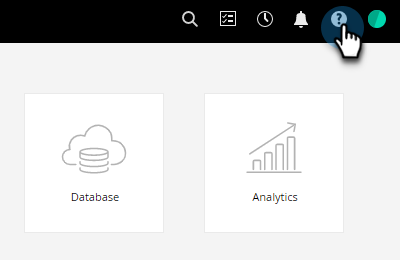
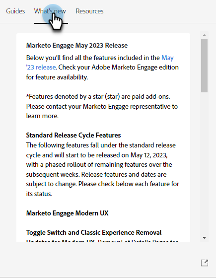
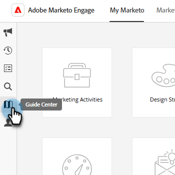

# 說明中心 {#help-center}

Adobe Marketo Engage 內的說明中心是取得協助的集中位置。 除了能向外連結至各種資源 (例如[產品文件](/help/marketo/home.md){target="_blank"}、[版本資訊](/help/marketo/release-notes/current.md){target="_blank"}、[Marketing Nation 社群](https://nation.marketo.com/){target="_blank"}) 之外，還可以存取按照經驗級別分類的實用產品內逐步說明。

## 如何存取 {#how-to-access}

有兩種不同的體驗，取決於您的訂閱是否已移轉至 Adobe 身分管理系統 (IMS)。

### 移轉至 Adobe IMS 前 {#pre-adobe-ims-integration}

這些步驟適用於&#x200B;_尚未_&#x200B;移轉至 [Adobe IMS](/help/marketo/product-docs/administration/marketo-with-adobe-identity/adobe-identity-management-overview.md){target="_blank"} 的 Marketo Engage 使用者。

[登入](https://login.marketo.com/){target="_blank"} Marketo Engage，按一下「說明」圖示。

#### 指南 {#guides}

指南是常用功能的簡易型逐步說明。

1. 按一下所需的指南即可檢視。

   

1. 按一下「**開始使用**」。

   

1. 按一下「**下一步**」，繼續進行。

   

1. 按一下「**完成**」，退出逐步說明。

   

   >[!TIP]
   >
   >您可以隨時按一下「**關閉**」，退出指南。

#### 新增功能 {#whats-new}

「新增功能」索引標籤包含 Marketo Engage 最新版本的詳細資料。

>[!TIP]
>
>按一下底部的箭頭圖示，即可在 Experience League 中檢視頁面。

#### 資源 {#resources}

「資源」索引標籤讓您可以快速又直接地透過各種方式取得關於 Marketo Engage 執行個體的其他協助。

### 移轉至 Adobe IMS 後 {#post-adobe-ims-integration}

這些步驟適用於已經移轉至 [Adobe IMS](/help/marketo/product-docs/administration/marketo-with-adobe-identity/adobe-identity-management-overview.md){target="_blank"} 的 Marketo Engage 使用者。

[登入](https://experience.adobe.com/){target="_blank"} Marketo Engage，按一下「說明」圖示。

說明中心便會顯示。 按一下所列出的任何協助資源，即可進入其對應的區域。 您也可以搜尋特定術語。

指南 (移轉至 Adobe IMS 前為說明中心的一部分) 現在位於左側導覽區域。

指南中心有兩個索引標籤，「指南」和「新增功能」。 指南是 Marketo Engage 常用功能的簡易型逐步說明。 按一下所需的指南，或搜尋特定的指南。

「新增功能」索引標籤包含 Marketo Engage 最新版本的詳細資料。

