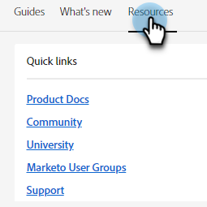

# 支援中心 {#help-center}

Adobe Marketo Engage中的說明中心是取得協助的集中位置。 除了連結到各種資源（例如[產品檔案](/help/marketo/home.md){target="_blank"}、[發行資訊](/help/marketo/release-notes/current.md){target="_blank"}、[行銷國家社群](https://nation.marketo.com/){target="_blank"}）之外，您還可以存取按體驗層級組織的有用產品內逐步解說。

## 如何存取 {#how-to-access}

根據您的訂閱是否已移轉至Adobe Identity Management系統(IMS)，會有兩種不同的體驗。

### Adobe IMS前移轉 {#pre-adobe-ims-integration}

這些步驟適用於尚&#x200B;_未_&#x200B;移轉至[Adobe IMS](/help/marketo/product-docs/administration/marketo-with-adobe-identity/adobe-identity-management-overview.md){target="_blank"}的Marketo Engage使用者。

[登入](https://login.marketo.com/){target="_blank"}Marketo Engage並按一下[說明]圖示。

#### 指南 {#guides}

指南可作為常用功能的快速逐步說明。

1. 按一下所需的指南進行檢視。

   

1. 按一下&#x200B;**開始使用**。

   

1. 按一下[下一步]&#x200B;**&#x200B;**&#x200B;繼續。

   

1. 按一下&#x200B;**完成**&#x200B;結束逐步說明。

   

   >[!TIP]
   >
   >隨時按一下&#x200B;**關閉**&#x200B;以結束指南。

#### 新增功能 {#whats-new}

「新增功能」索引標籤包含Marketo Engage最新版本的詳細資料。

>[!TIP]
>
>按一下底部的箭頭圖示，以在Experience League中檢視頁面。

#### 資源 {#resources}

「資源」索引標籤可讓您快速而直接地存取各種方法，以取得Marketo Engage執行個體的額外協助。

### Adobe IMS後移轉 {#post-adobe-ims-integration}

這些步驟適用於已移轉至[Adobe IMS](/help/marketo/product-docs/administration/marketo-with-adobe-identity/adobe-identity-management-overview.md){target="_blank"}的Marketo Engage使用者。

[登入](https://experience.adobe.com/){target="_blank"}Marketo Engage並按一下[說明]圖示。

「說明中心」即會出現。 按一下列出的任何說明資源，前往其個別區域。 您也可以搜尋特定詞語。

Guides （先前是Adobe IMS移轉前說明中心的一部分）現在位於左側導覽區域。

「指南中心」有兩個標籤，「指南」和「新增功能」。 指南可作為Marketo Engage中常用功能的快速逐步說明。 按一下所需的指南，或搜尋特定指南。

「新增功能」索引標籤包含Marketo Engage最新版本的詳細資料。

