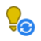

# Marketo Engage 圖示字彙表 {#icon-glossary}

以下為目前 Adobe Marketo Engage 介面所使用的圖示。若您需要參考 Marketo Classic 圖示，請參閱[這裡](/help/marketo/getting-started/things-to-know/classic-icon-glossary.md)。

## 一般圖示 {#general-icons}

<table>
 <tbody>
  <tr>
   <th style="width:25%">舊圖示</th>
   <th style="width:25%">新圖示</th>
   <th style="width:50%">說明</th>
  </tr>
  <tr>
   <td><strong>不適用</strong></td>
   <td></td>
   <td>帳戶智慧清單</td>
  </tr>
  <tr>
   <td></td>
   <td></td>
   <td>批次行銷活動 - 使用中</td>
  </tr>
  <tr>
   <td></td>
   <td></td>
   <td>批次行銷活動 - 非使用中</td>
  </tr>
  <tr>
   <td></td>
   <td></td>
   <td>預設方案</td>
  </tr>
  <tr>
   <td></td>
   <td></td>
   <td>電子郵件</td>
  </tr>
  <tr>
   <td></td>
   <td></td>
   <td>電子郵件方案</td>
  </tr>
  <tr>
   <td></td>
   <td></td>
   <td>電子郵件範本</td>
  </tr>
  <tr>
   <td></td>
   <td></td>
   <td>參與方案</td>
  </tr>
  <tr>
   <td></td>
   <td></td>
   <td>事件方案</td>
  </tr>
  <tr>
   <td></td>
   <td></td>
   <td>可執行的行銷活動</td>
  </tr>
  <tr>
   <td></td>
   <td></td>
   <td>欄位組織工具</td>
  </tr>
  <tr>
   <td></td>
   <td></td>
   <td>篩選器</td>
  </tr>
  <tr>
   <td><strong>不適用</strong></td>
   <td></td>
   <td>篩選器 - 使用中</td>
  </tr>
  <tr>
   <td></td>
   <td></td>
   <td>資料夾</td>
  </tr>
  <tr>
   <td></td>
   <td></td>
   <td>資料夾 - 已封存</td>
  </tr>
  <tr>
   <td></td>
   <td></td>
   <td>資料夾 - 已共用</td>
  </tr>
  <tr>
   <td></td>
   <td></td>
   <td>資料夾 - 已封鎖</td>
  </tr>
  <tr>
   <td></td>
   <td></td>
   <td>表單</td>
  </tr>
  <tr>
   <td></td>
   <td></td>
   <td>影像 (和檔案)</td>
  </tr>
  <tr>
   <td></td>
   <td></td>
   <td>應用程式內訊息</td>
  </tr>
  <tr>
   <td></td>
   <td></td>
   <td>應用程式內方案</td>
  </tr>
  <tr>
   <td></td>
   <td></td>
   <td>登陸頁面</td>
  </tr>
  <tr>
   <td></td>
   <td></td>
   <td>登陸頁面範本</td>
  </tr>
  <tr>
   <td></td>
   <td></td>
   <td>模型</td>
  </tr>
  <tr>
   <td></td>
   <td></td>
   <td>投票</td>
  </tr>
  <tr>
   <td></td>
   <td></td>
   <td>推播通知</td>
  </tr>
  <tr>
   <td></td>
   <td></td>
   <td>推薦優惠方案</td>
  </tr>
  <tr>
   <td></td>
   <td></td>
   <td>報告</td>
  </tr>
  <tr>
   <td><strong>不適用</strong></td>
   <td></td>
   <td>搜尋</td>
  </tr>
  <tr>
   <td></td>
   <td></td>
   <td>區段</td>
  </tr>
  <tr>
   <td></td>
   <td></td>
   <td>智慧清單</td>
  </tr>
  <tr>
   <td></td>
   <td></td>
   <td>智慧清單 - 已快取</td>
  </tr>
  <tr>
   <td></td>
   <td></td>
   <td>簡訊訊息</td>
  </tr>
  <tr>
   <td></td>
   <td></td>
   <td>程式碼片段</td>
  </tr>
  <tr>
   <td></td>
   <td></td>
   <td>社交按鈕</td>
  </tr>
  <tr>
   <td></td>
   <td></td>
   <td>靜態清單</td>
  </tr>
  <tr>
   <td></td>
   <td></td>
   <td>抽獎</td>
  </tr>
  <tr>
   <td></td>
   <td></td>
   <td>測試組</td>
  </tr>
  <tr>
   <td></td>
   <td></td>
   <td>觸發程序 - 使用中</td>
  </tr>
  <tr>
   <td><strong>不適用</strong></td>
   <td></td>
   <td>觸發程序 - 非使用中</td>
  </tr>
  <tr>
   <td></td>
   <td></td>
   <td>工作區</td>
  </tr>
  <tr>
   <td></td>
   <td></td>
   <td>YouTube 影片</td>
  </tr>
 </tbody>
</table>

## 批次行銷活動 {#batch-campaigns}

<table>
 <tbody>
  <tr>
   <th style="width:25%">舊圖示</th>
   <th style="width:25%"> 新圖示</th>
   <th style="width:50%">說明</th>
  </tr>
  <tr>
   <td></td>
   <td></td>
   <td>已執行，無後續</td>
  </tr>
  <tr>
   <td></td>
   <td></td>
   <td>無效</td>
  </tr>
  <tr>
   <td></td>
   <td></td>
   <td>未執行過</td>
  </tr>
  <tr>
   <td></td>
   <td></td>
   <td>執行中，處於等待步驟</td>
  </tr>
  <tr>
   <td></td>
   <td></td>
   <td>已安排執行</td>
  </tr>
  <tr>
   <td></td>
   <td></td>
   <td>已安排再次執行</td>
  </tr>
  <tr>
   <td></td>
   <td></td>
   <td>由培養使用</td>
  </tr>
 </tbody>
</table>

## 觸發程序行銷活動 {#trigger-campaigns}

<table>
 <tbody>
  <tr>
   <th style="width:25%">舊圖示</th>
   <th style="width:25%"> 新圖示</th>
   <th style="width:50%">說明</th>
  </tr>
  <tr>
   <td></td>
   <td></td>
   <td>使用中</td>
  </tr>
  <tr>
   <td></td>
   <td></td>
   <td>收到請求</td>
  </tr>
  <tr>
   <td><strong>不適用</strong></td>
   <td></td>
   <td>非使用中</td>
  </tr>
  <tr>
   <td></td>
   <td></td>
   <td>無效</td>
  </tr>
 </tbody>
</table>

## 電子郵件方案 {#email-programs}

<table>
 <tbody>
  <tr>
   <th style="width:25%">舊圖示</th>
   <th style="width:25%"> 新圖示</th>
   <th style="width:50%">說明</th>
  </tr>
  <tr>
   <td></td>
   <td></td>
   <td>已中止</td>
  </tr>
  <tr>
   <td></td>
   <td></td>
   <td>已完成</td>
  </tr>
  <tr>
   <td></td>
   <td></td>
   <td>未核准</td>
  </tr>
  <tr>
   <td></td>
   <td></td>
   <td>已安排</td>
  </tr>
 </tbody>
</table>

## 參與方案 {#engagement-programs}

<table>
 <tbody>
  <tr>
   <th style="width:25%">舊圖示</th>
   <th style="width:25%"> 新圖示</th>
   <th style="width:50%">說明</th>
  </tr>
  <tr>
   <td></td>
   <td></td>
   <td>關閉</td>
  </tr>
  <tr>
   <td></td>
   <td></td>
   <td>開啟</td>
  </tr>
 </tbody>
</table>

## 應用程式內方案 {#in-app-programs}

<table>
 <tbody>
  <tr>
   <th style="width:25%">舊圖示</th>
   <th style="width:25%"> 新圖示</th>
   <th style="width:50%">說明</th>
  </tr>
  <tr>
   <td></td>
   <td></td>
   <td>已核准</td>
  </tr>
  <tr>
   <td></td>
   <td></td>
   <td>尚未設定</td>
  </tr>
  <tr>
   <td></td>
   <td></td>
   <td>已暫停</td>
  </tr>
  <tr>
   <td><strong>不適用</strong></td>
   <td></td>
   <td>已安排</td>
  </tr>
  <tr>
   <td></td>
   <td></td>
   <td>已停止</td>
  </tr>
 </tbody>
</table>

## 資產 {#assets}

<table>
 <tbody>
  <tr>
   <th style="width:25%">舊圖示</th>
   <th style="width:25%"> 新圖示</th>
   <th style="width:50%">說明</th>
  </tr>
  <tr>
   <td></td>
   <td></td>
   <td>已核准</td>
  </tr>
  <tr>
   <td></td>
   <td></td>
   <td>草稿</td>
  </tr>
  <tr>
   <td></td>
   <td></td>
   <td>已核准，仍有草稿</td>
  </tr>
 </tbody>
</table>

## 區段 {#segments}

<table>
 <tbody>
  <tr>
   <th style="width:25%">舊圖示</th>
   <th style="width:25%"> 新圖示</th>
   <th style="width:50%">說明</th>
  </tr>
  <tr>
   <td><strong>不適用</strong></td>
   <td></td>
   <td>已核准 - 計算中</td>
  </tr>
  <tr>
   <td><strong>不適用</strong></td>
   <td></td>
   <td>已核准 - 重新計算中</td>
  </tr>
  <tr>
   <td><strong>不適用</strong></td>
   <td></td>
   <td>草稿 - 計算中</td>
  </tr>
 </tbody>
</table>
