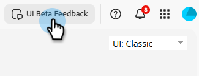

# Marketo Engage全新UI {#new-ui}

感謝您參與新的Marketo Engage UI測試版。 此更新更新Marketo Engage的樣式符合現代化要求，並提升回應能力，而不會變更功能。 新的UI可使用下拉式清單進行存取，該下拉式清單會出現在Marketo Engage中大部分頁面的右上角。

## 開始之前 {#before-starting}

您必須具備以下條件才能存取新的UI：

* 已提供您的一或多個Marketo Engage使用者角色的&#x200B;_存取新UI_&#x200B;許可權。

* 出現提示時接受開放Beta測試條款。

## 新使用者介面許可權 {#new-ui-permission}

管理員可以授予&#x200B;_存取新的UI_&#x200B;許可權給一或多個使用者角色。

1. 在&#x200B;**管理員**&#x200B;區域中，選取&#x200B;**使用者與角色**。

   

1. 按一下「**角色**」標籤。 選取想要的角色，然後按一下&#x200B;**編輯角色**。

   

>[!NOTE]
>
>您也可以建立新角色。

1. 選取&#x200B;**存取新主題**&#x200B;核取方塊，然後按一下&#x200B;**儲存**。

   

## 全新和傳統UI {#new-and-classic}

若要切換到新的UI，請按一下右上角的UI下拉式清單，然後選取&#x200B;**新增(Beta)**。

如果您因為任何原因需要切換回，請再次按一下UI下拉式清單，然後選取&#x200B;**Classic**。

## 提交意見反應 {#feedback}

我們非常歡迎您提供意見反應。 如果您在探索新UI時遇到存取或使用功能的任何問題，或有任何建議或疑慮，請按一下右上方的UI Beta意見回饋按鈕。

