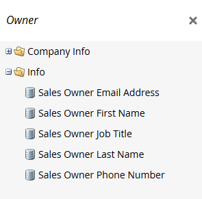

# Marketo術語更新 {#updates-to-marketo-terminology}

我們正在對我們的平台進行一些更改，這將影響某些東西的名稱。 如果您在2016年3月起有新的Marketo例項，或貴公司在2016年7月後續約，您現在可能會看到新術語。

雖然您可能會在Marketo檔案中看到不同的術語，但請放心，每篇文章很快都會更新以反映這些變更。 所有指示都相同。

那麼，有什麼改變？

## 銷售機會現在是人 {#lead-is-now-person}

最大的變更是將Lead/Lead更名為Person/People。

<table> 
 <colgroup> 
  <col> 
  <col> 
 </colgroup> 
 <tbody> 
  <tr> 
   <td><strong>舊</strong></td> 
   <td><strong>最新</strong></td> 
  </tr> 
  <tr> 
   <td> 
    
 
      
    
</td> 
   <td> 
    
 
      
    
</td> 
  </tr> 
 </tbody> 
</table>

在某些情況下，「Lead」一詞被簡單移除。

<table> 
 <colgroup> 
  <col> 
  <col> 
 </colgroup> 
 <tbody> 
  <tr> 
   <td><strong>舊</strong></td> 
   <td><strong>最新</strong></td> 
  </tr> 
  <tr> 
   <td> 
    
 
      
    
</td> 
   <td> 
    
 
     

 
    
</td> 
  </tr> 
 </tbody> 
</table>

銷售機會與人員 **是一樣的**.

## 代號 {#tokens}

含有單字的代號會引入 **不變**. 我們為任何混亂表示歉意；不過，若變更所有代號以符合新術語，將會中斷目前使用的許多代號。 因此您仍會看到「`{{lead.First Name}}`.&quot; 沒有人員專屬的代號。

>[!NOTE]
>
>那裡 *is* 稱為「人員附註」的代號，但代號始終存在。 它通常用於CRM中的說明欄位（如果有的話）。

## 欄位管理 {#field-management}

包含Lead一詞的欄位已替換為Person，或Lead一詞已被刪除。 但「銷售機會擁有者」欄位是一個明顯的例外。 它現在稱為「銷售所有者」。

<table> 
 <colgroup> 
  <col> 
  <col> 
 </colgroup> 
 <tbody> 
  <tr> 
   <td><strong>舊</strong></td> 
   <td><strong>最新</strong></td> 
  </tr> 
  <tr> 
   <td> 
    
 
      
    
</td> 
   <td> 
    
 
      
    
</td> 
  </tr> 
 </tbody> 
</table>

>[!NOTE]
>
>如需受影響欄位名稱的完整清單，請造訪此 [支援文章](https://nation.marketo.com/docs/DOC-4218#jive_content_id_Field_Names_and_Tokens){target=&quot;_blank&quot;}。

## 即時個人化(RTP)現在稱為網頁個人化 {#real-time-personalization-rtp-is-now-web-personalization}

<table> 
 <colgroup> 
  <col> 
  <col> 
 </colgroup> 
 <tbody> 
  <tr> 
   <td><strong>舊</strong></td> 
   <td><strong>最新</strong></td> 
  </tr> 
  <tr> 
   <td> 
    
 
      
    
</td> 
   <td> 
    
 
      
    
</td> 
  </tr> 
 </tbody> 
</table>

除了名稱變更外，現在還包含四個不同的應用程式：

| **[網頁個人化](https://docs.marketo.com/display/DOCS/Web+Personalization+-+RTP){target=&quot;_blank&quot;}** | 主螢幕上有自己的磁貼 |
|---|---|
| **[帳戶型網路行銷](https://docs.marketo.com/display/DOCS/Account-Based+Web+Marketing){target=&quot;_blank&quot;}** | 可透過「網頁個人化」圖磚存取 |
| **[個人化重新鎖定](https://docs.marketo.com/display/DOCS/Website+Retargeting){target=&quot;_blank&quot;}** | 可透過「網頁個人化」圖磚存取 |
| **[預測內容](https://docs.marketo.com/display/DOCS/Predictive+Content){target=&quot;_blank&quot;}** | 主螢幕上有自己的磁貼 |

>[!NOTE]
>
>主畫面上顯示的圖磚會反映已購買的模組。

感謝您在此次更新期間的耐心。
