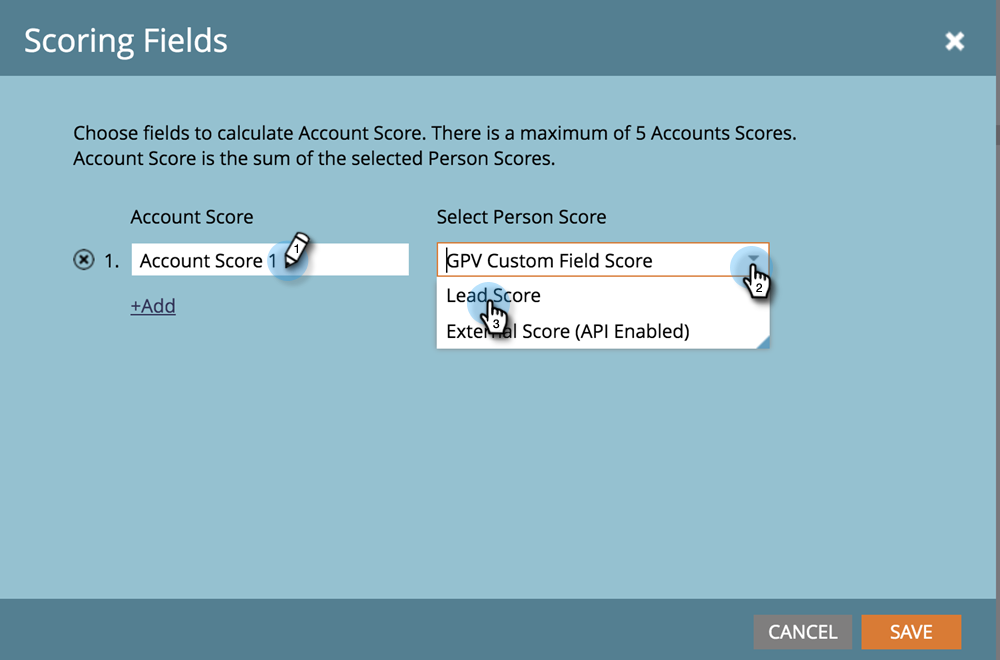

# 帳戶分數 {#account-score}

「帳戶計分」是「以帳戶為基礎的行銷」的重要部分。 它可協助您決定帳戶的參與程度。

## 什麼是帳戶計分？ {#what-is-account-scoring}

這是一種系統化方法，旨在幫助銷售和行銷團隊識別並排定最有可能購買的公司（包括潛在客戶）的優先順序。

在複雜的B2B購買程式世界中，單一個人做出購買決策的情況十分罕見。 往往有各種角色，各有各的需要。 基於帳戶的計分會將此納入考量，方法是從多個銷售機會匯總銷售機會分數，並在帳戶層級提供分數。

## 常見範例 {#common-examples}

| **帳戶參與分數** | 根據特定目標帳戶中不同通道（例如電子郵件、網頁和廣告）追蹤的行為活動，獲得深度參與。 |
|---|---|
| **帳戶產品興趣分數** | 目標帳戶中顯示對特定產品內容感興趣的人（例如下載白皮書）。 |
| **帳戶網路參與分數** | 訪問Web頻道的目標帳戶人員。 您可建立相同的分數來測量來自電子郵件、廣告或其他渠道的渠道參與度。 |

## 如何設定帳戶分數 {#how-to-configure-account-score}

>[!NOTE]
>
>**說明**
>
>若要計算帳戶分數，您必須先建立銷售線索分數。 Marketo ABM會自動將潛在客戶分數匯總至帳戶分數。 例如，我們將以上兩個範例(*Account **Product Interest Score*&#x200B;和&#x200B;*Account Web Engagement Score*)。
>
>首先，建立銷售機會分數欄位，從目標帳戶的每個銷售機會擷取相關詳細資訊。\
>然後，將這些銷售機會分數指派給其各自的帳戶分數：\
>帳戶產品興趣分數= SUM（銷售機會產品興趣分數）\
>帳戶網頁參與分數= SUM（潛在客戶網頁參與分數）

>[!NOTE]
>
>使用者可以建立多個帳戶參與分數，並指派不同的人員分數給不同的帳戶分數。

設定好銷售機會分數後，請依照下列步驟繼續。

1. 按一 **下管理**。

   

1. 按一下 **ABM**。

   

1. 在計分欄位中，按一下 **編輯**。

   

   >[!NOTE]
   >
   >您最多可以選擇**5個**欄位來計算「帳戶分數」。

1. 輸入帳戶分數名稱，按一下「選 **取人員分數** 」下拉式清單，然後選取對應的分數。

   

1. 按一下**+新增**以新增更多分數。

   

1. 新增所有想要的分數。 完成時 **按一下** 「儲存」。

   

