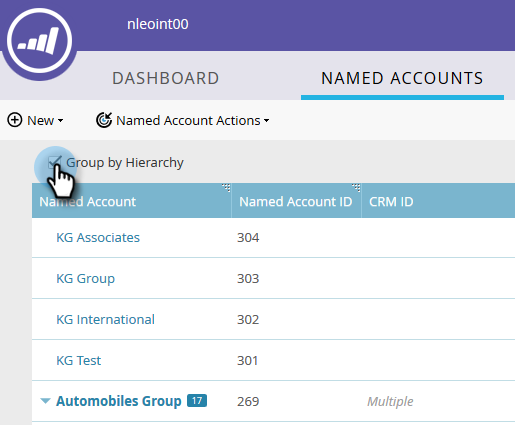

# 建立階層 {#create-a-hierarchy}

階層是指在CRM中建立。 但是，如果您沒有CRM，請依照下列步驟手動建立階層。

1. 在「命名帳戶」中，按一下「依階層 **分組」核取方塊** 。

   

   >[!NOTE]
   >
   >**提醒**
   >
   >
   >只有非CRM帳戶可用來手動建立階層。 CRM連結帳戶需要在CRM中建立其階層。

1. 使用ctrl+click(Windows)或Cmd+click(Mac)，選取您要在階層中一起群組的所有帳戶。

   

1. 按一下「 **指名帳戶動作** 」下拉式清單，然後選 **取「連結至指名帳戶」**。

   

   >[!NOTE]
   >
   >如果要取消帳戶連結，請遵循上述步驟，但選擇「從命名 **帳戶取消連結」**。

1. 從下拉式清單中選取「父指名帳戶」，然後按一下「 **連結**」。

   

1. 您的指名帳戶現在屬於階層。 按一下左側的箭頭，查看其所有子帳戶。

   

