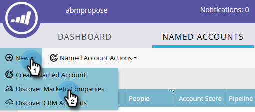

# Discover帳戶 {#discover-accounts}

使用Discover選項來識別潛在目標帳戶。

## 探索CRM帳戶 {#discover-crm-accounts}

從您的CRM中識別潛在目標帳戶。

>[!NOTE]
>
>在您將CRM與Market連接至ABM後， **** Discover CRM帳戶將會顯示所有CRM帳戶和相關資訊，以協助您選擇正確的命名帳戶。 Marketo會在從CRM收到的內容之上新增其他資訊。

**People** （在Discover CRM帳戶和Discover行銷公司中）:同時包括聯繫人和銷售線索。 您可使用Marketo的銷售機會對帳 [戶比對來發現銷售機會](http://docs.marketo.com/display/DOCS/Lead+to+Account+Matching)。 **潛在人員** （在Discover CRM帳戶和Discover行銷人員中）:顯示Marketo發現可能屬於CRM帳戶的潛在客源數。

**自訂CRM欄位** （僅限Discover CRM帳戶）:這有助於您調整銷售和行銷組織，以選擇正確的目標帳戶。 一旦您 [將自訂CRM欄位對應至Marketo ABM](http://docs.marketo.com/x/1wnG) ，我們將向您展示已對應的資料，以協助您識別目標帳戶。

1. 在「命名帳戶」中，按一 **下「新** 」下拉式清單並選 **取「Discover CRM帳戶」**。

   

1. 將會開啟新視窗／標籤。 選擇您要新增至您指名帳戶的CRM帳戶，然後按一下「下 **一步**」。

   

1. 預覽畫面會確認您的選取範圍。 按一下 **建立**。

   

   就這麼簡單！

   

## Discover行銷公司 {#discover-marketo-companies}

找出適合定位的公司。

>[!NOTE]
>
>在Discover Marketo Companies中，您將會看到並非來自您CRM的Marketo公司。

1. 在「命名帳戶」中，按一 **下「新** 」下拉式清單並選 **取「Discover行銷公司」**。

   

1. 將會開啟新視窗／標籤。 選取您要新增至「指名帳戶」的公司，然後按一下「下 **一步**」。

   

   >[!NOTE]
   >
   >在Discover Marketo公司和Discover CRM中，Marketo會自動：
   >
   > * 從您的Marketo資料庫中，尋找在記錄中列出該公司的人員。 如果您看到某些屬性的多個值（例如產業），這是因為Marketo為這些個別人員找到不同的值。 點擊次數最多的屬性會獲勝
   >
   >僅 **限Discover CRM** ,Marketo會自動：
   >
   > * 同步CRM聯絡人與指名的帳戶並建立關聯
   >
   >僅 **限Discover Marketo Companies** ,Marketo會自動：
   >
   > * 將大部分的網際網路服務供應商和公共網域(例如 [Yahoo.com](https://yahoo.com)、 [Gmail.com](https://gmail.com))篩選為公司名稱
      >
      > 
   * 刪除CRM帳戶。 如果您在一個記錄中有「Acme」和「Acme Inc」(或下列任何字尾：Co, Corp, Corporation, Gmbh, Inc, Incorporated, LLC, LLP, Ltd, PA, PC, PLC, PLLC)，我們將在ABM中將它們合併為&quot;Acme&quot;
   >
   >如果您希望Marketo依CRM ID或帳戶擁有者（而非依公司名稱）來消除重複帳戶，請聯絡 [Marketo支援](https://nation.marketo.com/t5/Support/ct-p/Support)。

1. 按一下「命名帳戶」欄下方的向下箭頭，以顯示下拉式清單。

   

   >[!CAUTION]
   >
   >未來，這些選定公司的任何新員工都會自動指派至其個別的指定帳戶。 請仔細檢查這些公司，並確定他們已指派至正確的命名帳戶。

1. 若要選取現有帳戶，請按一下「 **命名帳戶** 」下拉式清單，選擇所要的帳戶，然後按一下「下 **一步」**。

   

   您也可以選擇直接在下拉式方塊中輸入所要的名稱，以建立新的命名帳戶。 完成時，按一下離開框……

   

   ...然後您就會看到您的新指名帳戶。 此時，只需按一下步驟4 **中** 的「下一步」即可。

   

1. 按一下 **建立**。

   

   幹得好！

   

>[!NOTE]
>
>如果您看到所選取的CRM帳戶與Discover CRM格線中的項目不符，可能是由於下列一或多個項目所致：
>
>* 擁有不同的CRM帳戶，其名稱類似，而且已刪除重複的
>* 尚未發生下一個計畫的同步

>[!MORELIKETHIS]
>
>* [銷售機會與帳戶匹配](/help/marketo/product-docs/account-based-marketing/target/named-accounts/lead-to-account-matching.md)

