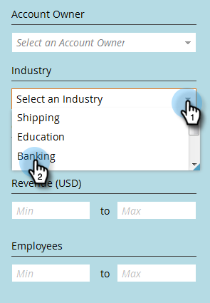

# 在命名帳戶中篩選 {#filtering-in-named-accounts}

篩選是快速縮小資料範圍的絕佳方式。

>[!NOTE]
>
>篩選下拉式清單中的資料會反映您CRM中已同步至Marketo的所有可用欄位。

1. 按一下篩選圖示。

   

   >[!NOTE]
   >
   >有幾個搜尋參陣列合。 在此範例中，我們找到： *行業=銀行業、國家=美國、最大員工= 10000*。

1. 按一下「 **Industry** （行業）」下拉式清單並選 **擇「Banking**」。

   

1. 按一下「 **國家** 」下拉式清單，然後選 **取「美國」**。

   

1. 在「 **Employees**」（員工）下，在「 **Min** 」（最小）欄位中鍵入「0」，在「 **Max** 」（最大值）欄位中鍵入「10000」，然後按一下「 **** Apply Apply」（應用）。

   

   就這樣！ 您的篩選結果會顯示在畫面的左側。

   >[!NOTE]
   >
   >若要新增更多篩選條件供您選擇，請按 **一下表單左下角的「新增篩選** 」。

