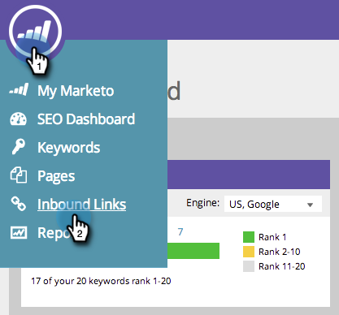
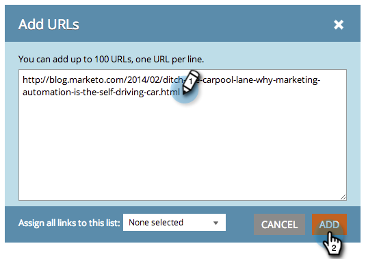

# SEO — 手動添加入站連結URL {#seo-add-an-inbound-link-url-manually}

您可以手動添加入站連結。 以下是方法：

1. 轉到 **[!UICONTROL 入站連結]** 的子菜單。

   

1. 按一下 **[!UICONTROL 添加URL]**。

   

1. 鍵入URL。 按一下 **[!UICONTROL 添加]**。

   

   >[!TIP]
   >
   >你知道你能 [將入站連結添加到新清單或現有清單](/help/marketo/product-docs/additional-apps/seo/understanding-seo/seo-managing-lists.md){target="_blank"}? 看看！

   

滾開！ 現在，您應看到新URL已添加到清單中。 收集所有資料可能需要一些時間。
