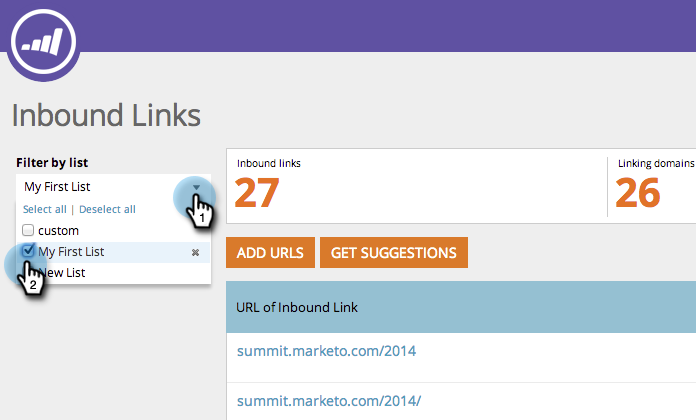
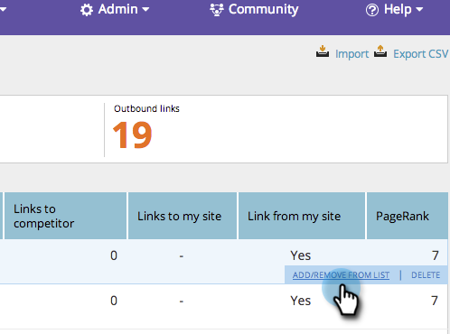
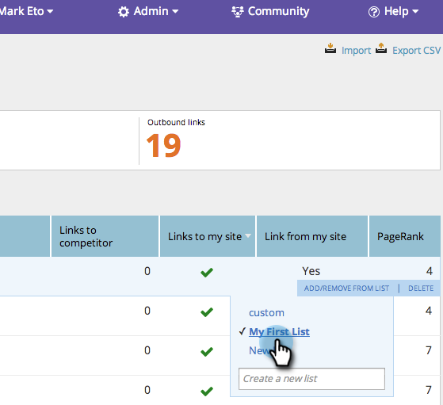

# SEO — 從清單中新增/移除傳入連結URL {#seo-add-remove-an-inbound-link-url-from-a-list}

您可以將傳入連結URL組織到心中的內容。

## 將傳入連結URL新增至清單 {#add-an-inbound-link-url-to-a-list}

1. 前往 **[!UICONTROL 傳入連結]** 區段。

   

1. 暫留在您要分類的傳入連結URL上。 按一下 **[!UICONTROL 新增/從清單移除]**.

   

1. 按一下您要前往的輸入連結URL清單。

   

>[!TIP]
>
>您也可以建立新的關鍵字清單，以供您前往。 只需在中輸入您想要的名稱 [!UICONTROL 建立新清單].

## 從清單中移除傳入連結URL {#remove-an-inbound-link-url-from-a-list}

有時您會想要從清單中移除傳入連結URL。

1. 按一下 **[!UICONTROL 傳入連結]**.

   

1. 按一下 **[!UICONTROL 依清單篩選]** 下拉式清單。 按一下您要清除的清單。

   

1. 暫留在您要移除的傳入連結URL上。 按一下 **[!UICONTROL 新增/從清單移除]**.

   

1. 將會檢查您要組織的清單。 按一下清單名稱，即可從此清單中移除傳入連結URL。

   

您成功了！ 重新整理頁面以更新顯示。
