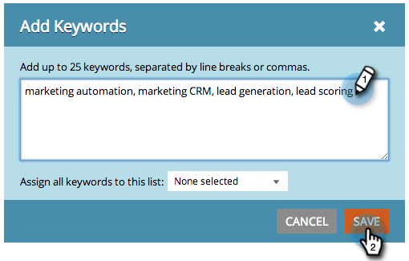

# SEO — 新增關鍵字 {#seo-add-keywords}

關鍵字是使用者輸入搜尋引擎的片語。 新增與您的業務最相關的關鍵字。

>[!NOTE]
>
>如果您有許多關鍵字，您可以 [以CSV檔案匯入](/help/marketo/product-docs/additional-apps/seo/keywords/seo-importing-keywords-with-a-csv.md).

1. 前往 **[!UICONTROL 關鍵字]** 區段。

   

1. 輸入您要鎖定的關鍵字，然後按一下 **[!UICONTROL 儲存]**.

   

   >[!TIP]
   >
   >以分行或逗號分隔關鍵字。

   

   >[!MORELIKETHIS]
   >
   >[瞭解關鍵字（摘要檢視）](/help/marketo/product-docs/additional-apps/seo/keywords/seo-understanding-keywords.md)

做得好！ 您現在應該會看到關鍵字清單的新增專案。
