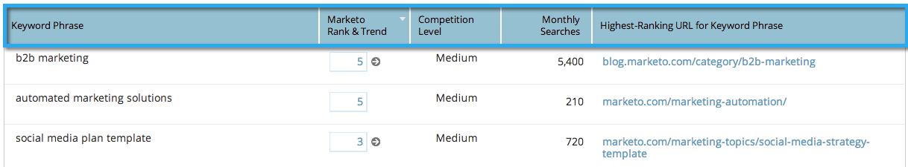

# SEO — 在關鍵字檢視中新增/移除欄 {#seo-add-remove-columns-from-your-keywords-view}

您可以調整關鍵字檢視，以顯示您最感興趣的資料。

1. 前往 **[!UICONTROL 關鍵字]** 區段。

   

   以下是預設欄：

   

1. 按一下齒輪圖示。

   

1. 選取或取消選取您要檢視的欄。 按一下 **[!UICONTROL 儲存]**.

   

   棒極了！ 您現在已自訂您的關鍵字檢視。

   

   >[!MORELIKETHIS]
   >
   >[瞭解關鍵字 — 摘要檢視](/help/marketo/product-docs/additional-apps/seo/keywords/seo-understanding-keywords.md)
