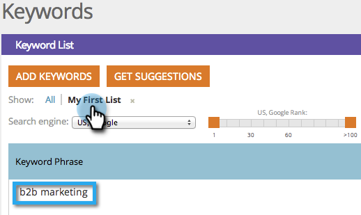

# SEO — 在清單中新增/移除關鍵字 {#seo-add-remove-keywords-from-a-list}

您可以使用清單保持所有關鍵字整齊有序。 這將使得在特定的關鍵字上以圓形圖輕鬆尋找資料。

## 新增至清單 {#add-to-a-list}

1. 前往 **[!UICONTROL 關鍵字]** 區段。

   

1. 將滑鼠停留在您要新增至清單的關鍵字上。 按一下 **[!UICONTROL 新增/從清單移除]**.

   

1. 按一下清單並新增關鍵字。

   

   >[!TIP]
   >
   >您也可以為關鍵字建立新清單。 只需鍵入名稱 **[!UICONTROL 建立新清單]**.

   

胡虎！ 選取您的清單以檢視新關鍵字。

## 從清單移除關鍵字 {#remove-keyword-from-list}

您也可以從清單中移除關鍵字。

1. 前往 **[!UICONTROL 關鍵字]** 區段。

   

1. 暫留在您要從清單中移除的關鍵字上。 按一下 **[!UICONTROL 新增/從清單移除]**.

   

1. 按一下您要移除關鍵字的清單。

   >[!NOTE]
   >
   >關鍵字目前所屬的所有清單都會有核取記號。 一旦從清單中移除，該檢查就會消失。

   

   完美無瑕，該關鍵字不再出現在此清單中。 重新整理您的頁面以更新顯示。

   >[!MORELIKETHIS]
   >
   >[瞭解關鍵字（摘要檢視）](/help/marketo/product-docs/additional-apps/seo/keywords/seo-understanding-keywords.md)
