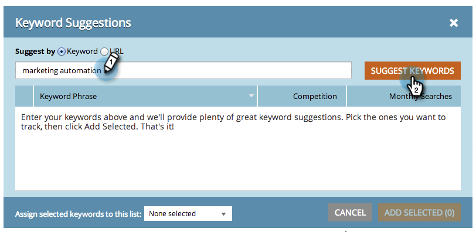

# SEO — 取得建議的關鍵字 {#seo-get-suggested-keywords}

Marketo SEO可建議您應該追蹤哪些關鍵字。 我們可以根據關鍵字或網站的URL提供建議。 試試看！

## 使用關鍵字取得關鍵字建議 {#get-keyword-suggestions-using-a-keyword}

1. 前往 **[!UICONTROL 關鍵字]** 區段。

   

1. 按一下 **[!UICONTROL 取得建議]**.

   

1. 輸入 **[!UICONTROL 關鍵字]**. 按一下 **[!UICONTROL 建議關鍵字]**.

   

   >[!TIP]
   >
   >您知道您可以  [將關鍵字新增至新的或現有的清單](/help/marketo/product-docs/additional-apps/seo/understanding-seo/seo-managing-lists.md) 就在這裡？

1. 選取建議的關鍵字。 按一下 **[!UICONTROL 新增選取專案]**.

   

   太棒了！ 已新增您的關鍵字。

   

   耀州！ 現在您知道如何根據關鍵字取得關鍵字建議，請嘗試根據URL取得建議。

## 從URL取得關鍵字建議  {#get-keyword-suggestions-from-a-url}

1. 前往 **[!UICONTROL 關鍵字]** 區段。

   

1. 按一下 **[!UICONTROL 取得建議]**.

   

1. 設定 **[!UICONTROL 建議者]** 至 **[!UICONTROL URL]**.

   

1. 輸入 **[!UICONTROL URL]** 並按一下 **[!UICONTROL 建議關鍵字]**.

   

   >[!TIP]
   >
   >您知道您可以 [將關鍵字新增至新的或現有的清單](/help/marketo/product-docs/additional-apps/seo/understanding-seo/seo-managing-lists.md) 就在這裡？

1. 選取建議的關鍵字。 按一下 **[!UICONTROL 新增選取專案]**.

   

太棒了！ 已新增您的關鍵字。

>[!MORELIKETHIS]
>
>* [瞭解關鍵字（摘要檢視）](/help/marketo/product-docs/additional-apps/seo/keywords/seo-understanding-keywords.md)
>* [在清單中新增/移除關鍵字](/help/marketo/product-docs/additional-apps/seo/keywords/seo-add-remove-keywords-from-a-list.md)
