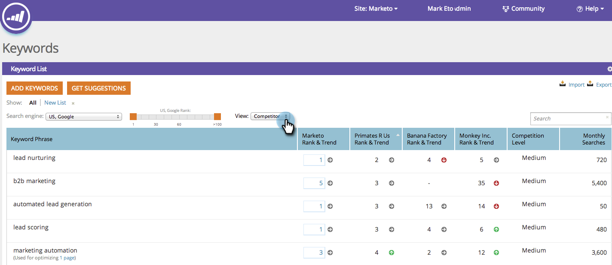

# SEO — 瞭解 [!UICONTROL 關鍵字] {#seo-understanding-keywords}

[!UICONTROL 關鍵字] 是SEO策略的骨幹。 您的目標是位於第一頁，儘可能靠近#1取與您的業務相關的關鍵字。

此 [!UICONTROL 關鍵字] 區段將向您展示網站達成此目標的成功程度，以及您如何棧疊至 [您的競爭對手](/help/marketo/product-docs/additional-apps/seo/understanding-seo/seo-add-competitors.md).

## [!UICONTROL 關鍵字]  — 摘要檢視 {#keywords-summary-view}

<table> 
 <thead> 
  <tr> 
   <th colspan="1" rowspan="1">欄名稱</th> 
   <th colspan="1" rowspan="1">說明</th> 
  </tr> 
 </thead> 
 <tbody> 
  <tr> 
   <td colspan="1" rowspan="1">關鍵字詞句</td> 
   <td colspan="1" rowspan="1">手邊的關鍵字。</td> 
  </tr> 
  <tr> 
   <td colspan="1" rowspan="1">排名與趨勢</td> 
   <td colspan="1" rowspan="1">
您網站對此關鍵字的排名。 箭頭會顯示您的關鍵字排名在前一週的趨勢分析 

  =排名

 =排名下降

 =排名相同
</td> 
  </tr> 
  <tr> 
   <td colspan="1" rowspan="1">競爭等級</td> 
   <td colspan="1" rowspan="1">取得特定關鍵字排名的困難。 </td> 
  </tr> 
  <tr> 
   <td colspan="1" rowspan="1">每月搜尋</td> 
   <td colspan="1" rowspan="1">每個月在關鍵字上發生的搜尋次數。 此資料是根據完全相符專案，僅適用於Google-US 12個月期間。 </td> 
  </tr> 
  <tr> 
   <td colspan="1" rowspan="1">關鍵字短語的最高排名URL</td>
   <td colspan="1" rowspan="1">URL中，此為關鍵字的最高排名。</td> 
  </tr> 
 </tbody> 
</table>

## [!UICONTROL 關鍵字]  — 競爭者檢視 {#keywords-competitor-view}

您也可以按一下「檢視」下拉式清單並選取競爭對手，以使用相同的量度來檢視競爭對手的表現。

太棒了！ 現在您已瞭解 [!UICONTROL 關鍵字] 區段，讓我們瞭解頁面和傳入連結。

>[!MORELIKETHIS]
>
>* [瞭解頁面](/help/marketo/product-docs/additional-apps/seo/pages/seo-understanding-pages.md)
>* [瞭解傳入連結](/help/marketo/product-docs/additional-apps/seo/inbound-links/seo-understanding-inbound-links.md)
