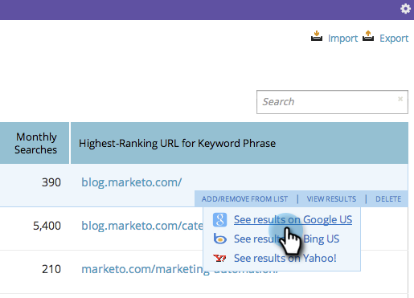

# SEO — 在搜索引擎中查看關鍵字結果 {#seo-view-keyword-results-in-search-engine}

如果您想查看搜索引擎內容的外觀，我們添加了一個方便的短切。

1. 轉到 **[!UICONTROL 關鍵字]** 的子菜單。

   

1. 懸停在關鍵字上。 按一下 **[!UICONTROL 查看結果]**。

   

1. 選擇要在其中查看結果的搜索引擎。

   

現在，您應在新窗口中看到關鍵字的搜索結果。

