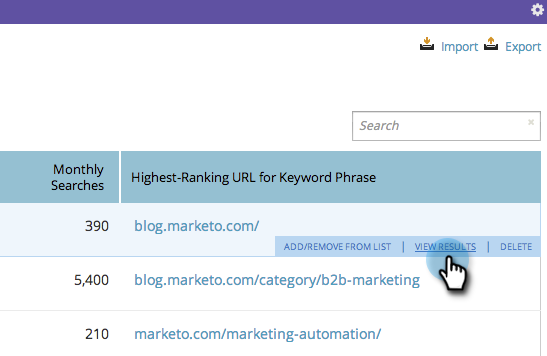
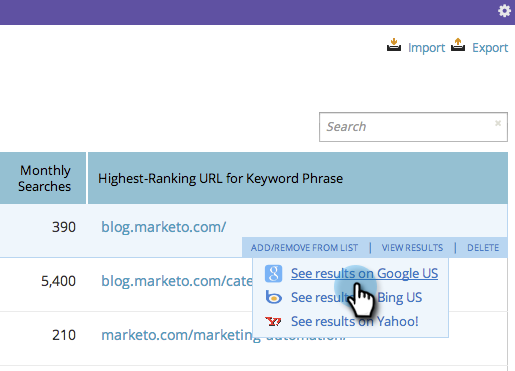
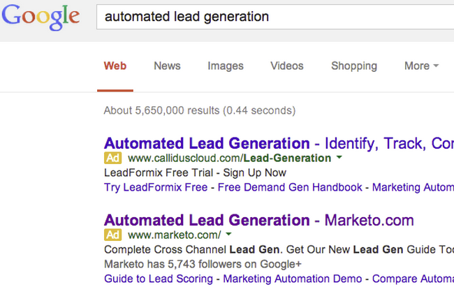

# SEO - 在搜尋引擎中檢視關鍵字結果 {#seo-view-keyword-results-in-search-engine}

如果您想要檢視內容在搜尋引擎中的顯示情形，我們已新增捷徑。

>[!IMPORTANT]
>
>在2026年3月31日，Marketo Engage將淘汰搜尋引擎最佳化功能。 請在3月30日或之前匯出任何相關資料。 [了解更多](https://nation.marketo.com/t5/product-blogs/marketo-engage-seo-feature-deprecation/ba-p/359060){target="_blank"}。
>
>* [匯出問題](https://experienceleague.adobe.com/en/docs/marketo/using/product-docs/additional-apps/seo/pages/seo-export-issues-to-csv){target="_blank"}
>* [匯出關鍵字結果](https://experienceleague.adobe.com/en/docs/marketo/using/product-docs/additional-apps/seo/keywords/seo-exporting-keyword-results){target="_blank"}
>* [匯出關鍵字趨勢](https://experienceleague.adobe.com/en/docs/marketo/using/product-docs/additional-apps/seo/reports/seo-use-the-keyword-trends-report#exporting-data){target="_blank"}
>* [匯出競爭者關鍵字趨勢](https://experienceleague.adobe.com/en/docs/marketo/using/product-docs/additional-apps/seo/reports/seo-use-the-competitor-kw-trends-report#exporting-data){target="_blank"}

1. 移至&#x200B;**[!UICONTROL Keywords]**&#x200B;區段。

   

1. 暫留在關鍵字上。 按一下「**[!UICONTROL View Results]**」。

   

1. 選擇您要檢視結果的搜尋引擎。

   

您現在應該會在新視窗中看到關鍵字的搜尋結果。

