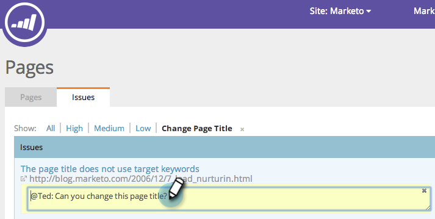

# SEO — 為頁面問題新增附註 {#seo-add-notes-to-page-issues}

您是否知道可以將附註作為個人提醒或團隊訊息添加到頁面問題中？

## 在頁面問題區段中新增附註 {#adding-notes-in-page-issues-section}

1. 前往「頁面」區段。

   

1. 在頁面標籤上，按一下 **問題**.

   

1. 將滑鼠指標暫留在您要新增附註的問題上。 按一下 **新增註解**.

   

1. 在黃色文本框中輸入注釋。 按一下文字方塊外部即會儲存附註。

>[!TIP]
>
>您可以按一下 **x** 左上角。

## 在頁面詳細資訊下鑽中添加附註 {#add-notes-in-page-detail-drill-down}

1. 前往「頁面」區段。

   

1. 按一下您要查看詳細資訊的頁面。

   

1. 將滑鼠指標暫留在您要新增附註的頁面問題上，然後按一下 **添加註釋**.

   

1. 輸入您的備注。 按一下 **儲存**.

   

   已添加您的注釋！

   
