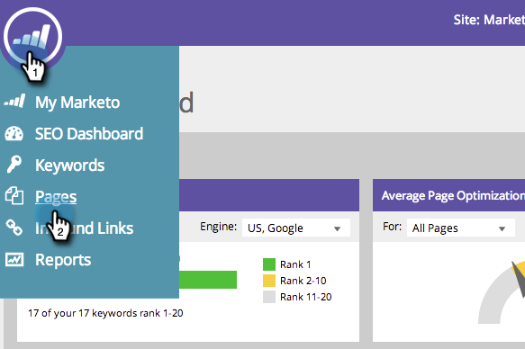

# SEO - 將問題匯出為 CSV {#seo-export-issues-to-csv}

如果您想要與Marketo以外的人員共用資訊，可以將[頁面問題](/help/marketo/product-docs/additional-apps/seo/pages/seo-understanding-pages.md)資料匯出至CSV檔案。 方法如下。

>[!IMPORTANT]
>
>在2026年3月31日，Marketo Engage [已棄用搜尋引擎最佳化](https://nation.marketo.com/t5/product-blogs/marketo-engage-seo-feature-deprecation/ba-p/359060){target="_blank"}功能。 [seo.marketo.com](https://seo.marketo.com/)仍在限定時間內可用。 請依照下列文章中的步驟匯出任何資料。
>
>* [匯出問題](https://experienceleague.adobe.com/zh-hant/docs/marketo/using/product-docs/additional-apps/seo/pages/seo-export-issues-to-csv){target="_blank"}
>* [匯出關鍵字結果](https://experienceleague.adobe.com/zh-hant/docs/marketo/using/product-docs/additional-apps/seo/keywords/seo-exporting-keyword-results){target="_blank"}
>* [匯出關鍵字趨勢](https://experienceleague.adobe.com/zh-hant/docs/marketo/using/product-docs/additional-apps/seo/reports/seo-use-the-keyword-trends-report#exporting-data){target="_blank"}
>* [匯出競爭者關鍵字趨勢](https://experienceleague.adobe.com/zh-hant/docs/marketo/using/product-docs/additional-apps/seo/reports/seo-use-the-competitor-kw-trends-report#exporting-data){target="_blank"}

1. 移至&#x200B;**[!UICONTROL Pages]**&#x200B;區段。

   

1. 按一下您要檢視其詳細資訊的頁面。

   

   這是[頁面詳細資料深入分析](/help/marketo/product-docs/additional-apps/seo/pages/seo-using-the-page-detail-drill-down.md)。 **[!UICONTROL Page Optimization Results]**&#x200B;是該特定頁面所有問題的清單。

   

1. 按一下「**[!UICONTROL Export]**」。

   
