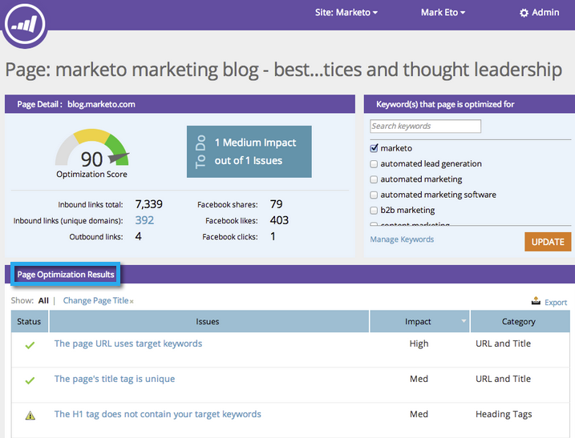

# SEO — 將問題導出為CSV {#seo-export-issues-to-csv}

您可以導出 [頁面問題](/help/marketo/product-docs/additional-apps/seo/pages/seo-understanding-pages.md) 資料到CSV檔案，如果您想與Marketo以外的人共用該資訊。 這是方法。

1. 轉到 **[!UICONTROL 頁面]** 的子菜單。

   

1. 按一下要查看詳細資訊的頁面。

   

   這是 [頁面詳細資訊向下鑽取](/help/marketo/product-docs/additional-apps/seo/pages/seo-using-the-page-detail-drill-down.md)。 **[!UICONTROL 頁面優化結果]** 是該特定頁面所有問題的清單。

   

1. 按一下 **[!UICONTROL 導出]**。

   

完美！ 您現在已將此頁面的所有問題下載到CSV檔案。
