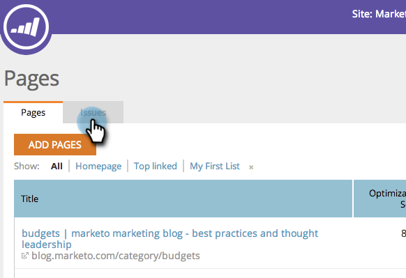

# SEO — 刪除/刪除頁面問題 {#seo-remove-delete-a-page-issue}

並非所有頁面問題都對您有用。 下面是如何刪除。

1. 轉到 **[!UICONTROL 頁面]** 的子菜單。

   

1. 在 [!UICONTROL 頁面] ，按一下 **[!UICONTROL 問題]**。

   

1. 將滑鼠懸停在要刪除的頁面問題上。 按一下 **[!UICONTROL 刪除]**。

   

1. 按一下 **[!UICONTROL 刪除]** 將永久刪除此頁面問題。

   >[!CAUTION]
   >
   >無法撤消此操作。 刪除問題後，您可以通過刪除頁面並將其重新添加來重建問題。

   

您的頁面問題現在已刪除。
