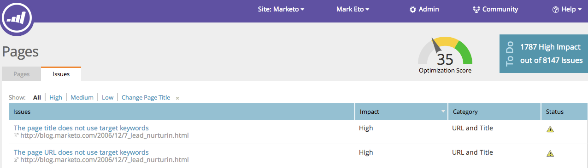

# SEO — 瞭解頁面 {#seo-understanding-pages}

## 頁面最佳化分數/待辦事項Widget {#page-optimization-score-to-do-widget}

頁面 [!UICONTROL 最佳化分數] 是頁面針對搜尋最佳化的整體排名，以1到100為分母。 這是以SEO中數十種最佳實務為基礎所建立。

* 0 - 35 =未最佳化
* 35 - 70 =在右邊
* 70 - 100 =做得很好！

>[!TIP]
>
>按一下 [!UICONTROL 高影響力] 中的連結 [!UICONTROL 待辦事項] 方塊中，這會將您重新導向至 [!UICONTROL 問題索引標籤] 並顯示要解決的高優先順序問題。

## [!UICONTROL 頁面] 標籤 {#pages-tab}

此 **[!UICONTROL 頁面] 標籤** 顯示您網站上個別頁面的搜尋最佳化程度。

| 欄名稱 | 說明 |
|---|---|
| [!UICONTROL 標題] | 網域中所有頁面的標題和URL。 驗證您的網域。 |
| [!UICONTROL 最佳化分數] | 用來顯示您的頁面在1到100之間最佳化搜尋效果的秘訣。 |
| [!UICONTROL 連結] | 至少有1個傳入連結可連結至您網站的不同網域數目。 |
| [!UICONTROL 目標關鍵字] | 您決定最佳化每個頁面的關鍵字。 [這需要您的輸入](/help/marketo/product-docs/additional-apps/seo/pages/seo-using-the-page-detail-drill-down.md). |

## [!UICONTROL 問題] 標籤 {#issues-tab}

此 **[!UICONTROL 問題] 標籤** 將確定您可以進行哪些改善以提高最佳化分數和排名。

| 欄名稱 | 說明 |
|---|---|
| [!UICONTROL 問題] | 有助於改善最佳化分數的可操作專案清單。 |
| [!UICONTROL 影響] | 這對於您的整體分數有多重要。 請先修正高影響力的專案！ |
| [!UICONTROL 類別] | 所報告的問題型別。 |
| [!UICONTROL 狀態] | 任務完成還是仍然開啟。 在您和您的網站管理員修正您網站上的問題後，狀態應變更為「已解決」（綠色檢查）。 |

棒極了，現在您已瞭解頁面的基本知識，請檢視以下資訊： [頁面詳細資料向下展開文章](/help/marketo/product-docs/additional-apps/seo/pages/seo-using-the-page-detail-drill-down.md) 以進一步瞭解您可以做的酷事。
